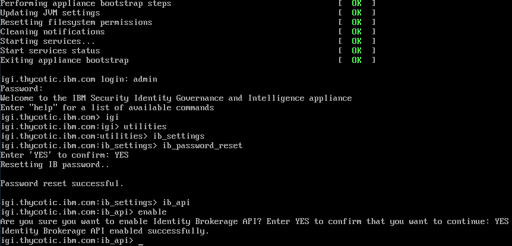
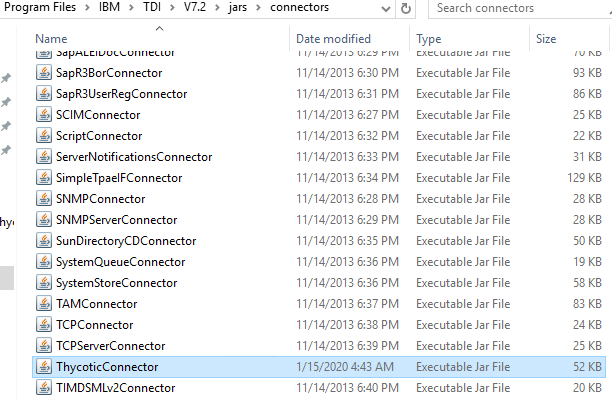
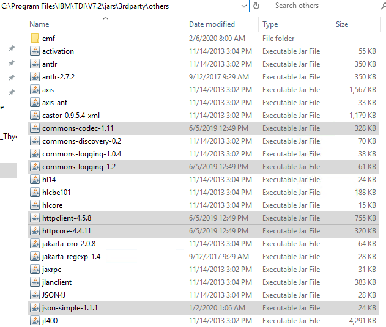
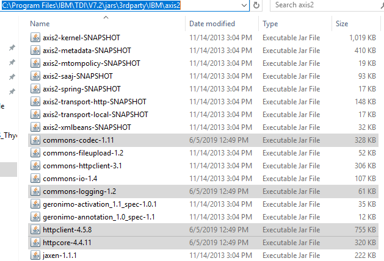
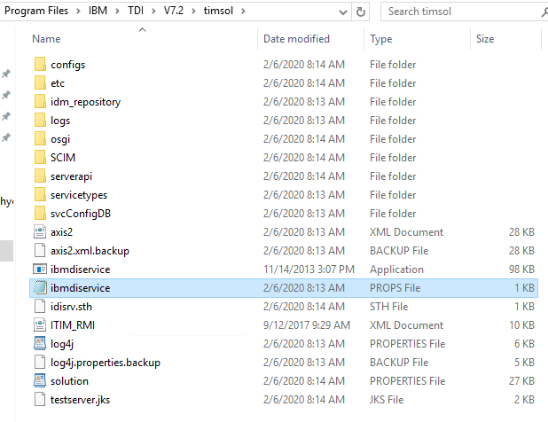
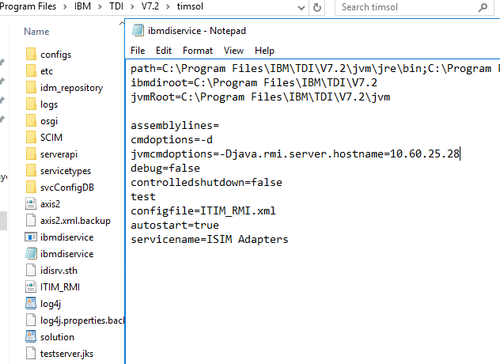
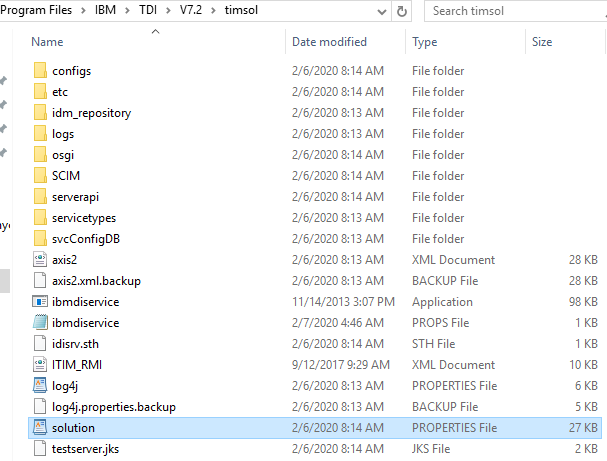
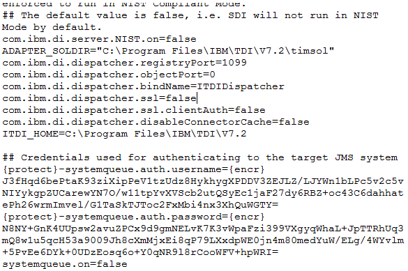

[title]: # (Configuring IBM IGI GUI and Dispatcher Folder)
[tags]: # (introduction)
[priority]: # (101)
# Configuring IBM IGI GUI and Dispatcher Folder to Access Admin Console

You need to configure IBM IGI GUI and Timsol to establish connection with Secret Server.

## Update files in folders

You have to update the files in folders such as Connectors, Axix2, Others, and Timsol.

__To update the files in folders:__

1. Go to the virtual appliance.

   
1. Login using the __login__ and __Password__.
1. Type the command `igi` and press __Enter__.
1. Type the command `utilities` and press __Enter__.
1. Type the command `ib_settings` and press __Enter__.
1. Type the command `ib_password_reset` and press __Enter__.
1. Type `YES` to confirm password reset and press __Enter__. The password reset is successful.
1. Type the command `ib_api` and press __Enter__.
1. Type the command `enable` and press __Enter__
1. Type `YES` if you are sure you want to enable Identity Brokerage API.
1. Go to __IBM Security Identity Governance and Intelligence Appliance__ dashboard.

   
1. In the __Server Control__ area, select the server and click __Restart__.
1. In the __Windows Search__ box type `services`. The results are auto-populated. Click __Services__. The __Services__ window appears.

   
1. Verify if the __IBM Security Directory Integrator (ISIM Adapters)__ service is running.
1. Go to __Thycotic Adapter__ > __SIA_V7.1.5_SSS_Thycotic_Sec_Serv__ and copy `ThycoticConnector` file.
1. Go to `C:\Program Files\IBM\TDI\V7.2\jars\connectors` and paste `ThycoticConnector`.

   > __Note__: Stop the __IBM Security Directory Integrator__ service before pasting the file.
   
1. Go to `C:\Program Files\IBM\TDI\V7.2\jars\3rdparty\others` and paste the following files here :
     * `commons-codec-1.11`

     * `commons-logging-1.2`

     * `httpclient-4.5.8`

     * `httpcore-4.4.11`

     * `json-simple-1.1.1`

   > __Note__: Download these files from internet.

   
1. Go to `C:\Program Files\IBM\TDI\V7.2\jars\3rdparty\IBM\axis2` and delete the existing version of the following files: 
   * `commons-codec`
   * `commons-logging`
   * `httpclient`
   * `httpcore`

   and  paste the latest version of the following files:

   * `commons-codec-1.11`
   * `commons-logging-1.2`
   * `httpclient-4.5.8`
   * `httpcore-4.4.11`

   > __Note__: Download these files from internet.
   
1. Go to `C:\Program Files\IBM\TDI\V7.2\timsol`.

   
1. Select the `ibmdiservice` file and open it in Notepad in administrative mode.

   
1. In the `jvmcmdoptions`, type `-Djava.rmi.server.hostname= <server hostname where Tivoli directory installer is installed and security directory integrator is installed>` and save the file.
1. In the `Timsol` folder, select the `solution` file and open it Wordpad in administrative mode.

   
1. In the `com.ibm.di.dispatcher.ssl`, delete `true` and type `false` and save the file.

   
The folders are updated successfully. Now, you need to verify the validity of the certificate.
