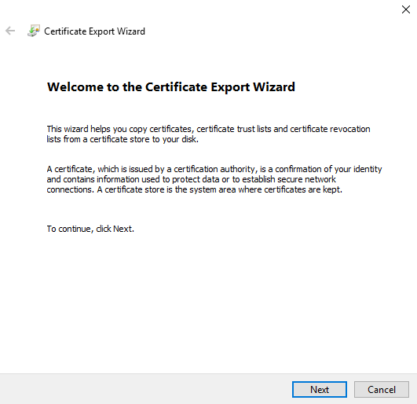
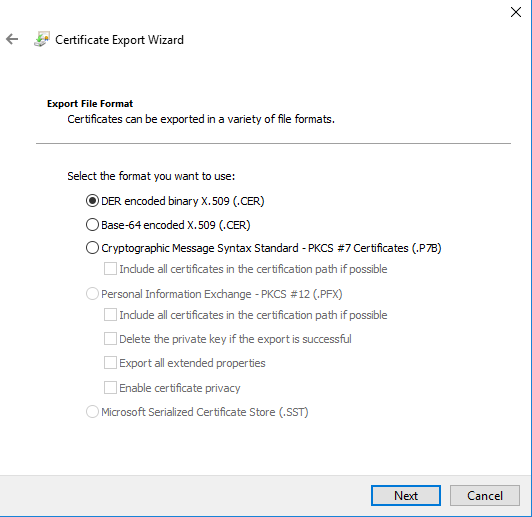
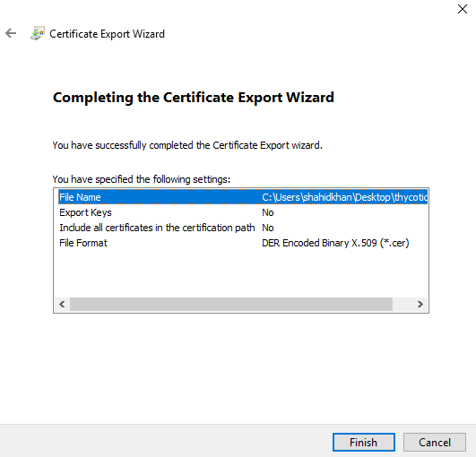
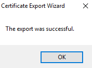
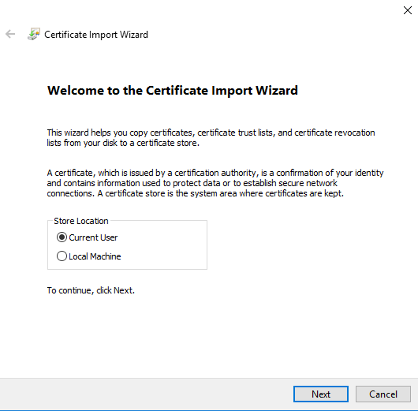
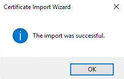
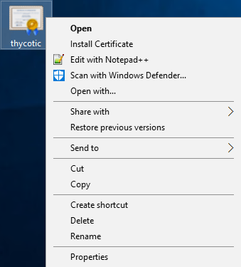
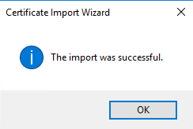

[title]: # (Import Thycotic certificate)
[tags]: # (introduction)
[priority]: # (103)
# Import Thycotic certificate

For secure connection between Thycotic Secret Server and IBM IGI, you need to import Thycotic certificate.

__To import Thycotic certificate:__

1. Click __Not secure__ part of the Thycotic Server URL . __Your connection to this site is not secure__ dialog box appears.

   
1. Click __Certificate (Invalid)__. The __Certificate__ dialog box appears.

   
1. Click __Details | Copy to File__. The __Welcome to the Certificate Export Wizard__
 appears.

   
1. Click __Next__. The __Export File Format__ panel appears.

   
1. Click __Next__. The __File to Export__ panel appears.

   
1. In the __File name__ text box, type the name for the certificate to be exported.
1. Click __Browse__ and select the location where you want to export the certificate.
1. Click __Next__. The __Completing the Certificate Export Wizard__ appears.

   
1. Click __Finish__. The message, ‘__The export was successful.__’ appears. The certificate is exported to the location selected.

   
1. Right-click the certificate where you have exported and click __Install Certificate__.

   
1. The __Welcome to the Certificate Import Wizard__ appears.

   
1. In the __Store Location__ area, select __Current User__ and then click __Next__. The __Certificate Store__ panel  appears.

   
1. Select __Place all certificates in the following store__ and then click __Browse__.
1. Select __Personal__ folder and then click __Next__. The __Completing the Certificate Import Wizard__ panel appears.

   
1. Click __Finish__. The message ‘__The import was successful.__’ appears.

   
1. Right-click the certificate where you have exported and click __Install Certificate__.

   
1. The __Welcome to the Certificate Import Wizard__ appears.

   
1. In the __Store Location__ area, select __Current User__ and then click __Next__. The __Certificate Store__ panel  appears.

   
1. Select __Place all certificates in the following store__ and then click __Browse__.
1. Select __Trusted Root Certification Authorities__ folder and then click __Next__. The __Completing the Certificate Import Wizard__ panel appears.

   
1. Click __Finish__. The message ‘__The import was successful.__’ appears.

   

The Thycotic certficate is imported successfully. Now you need to add the certificate.
