[title]: # (Update user details)
[tags]: # (introduction)
[priority]: # (108)
# Update user details in Secret Server through IBM IGI

1. Click __Account Configurations__.

   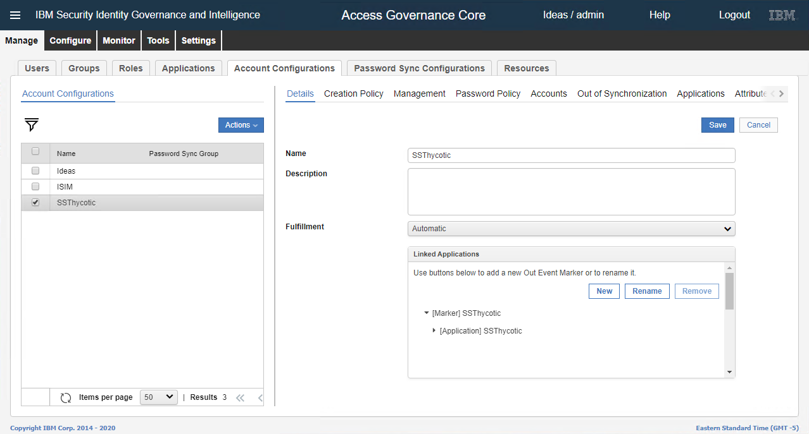
1. Select the account.
1. On the right-hand side, click __Attribute-to-Permission Mapping__.

   
1. In the __Actions__ list, click __Discover Account attributes from Target__.

   
1. The __Discover Attributes from Target__ dialog box appears.

   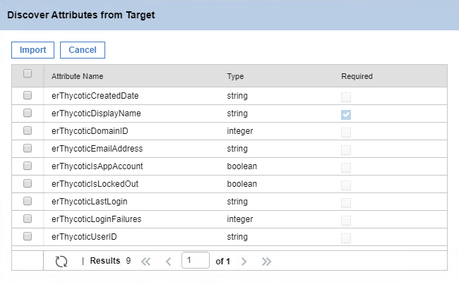
1. Select the __Attribute Name__ check box in the header.

   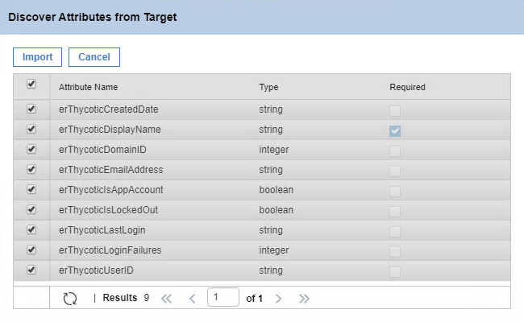
1. Click __Import__. A message, ‘__Operation successfully completed.__’ appears. Click __Ok__.The files are imported.

   
1. On the right-hand side, click __Target Attributes__.

   
1. In the __Actions__ list, click __Discover Account attributes from Target__.

   
1. The __Discover Attributes from Target__ dialog box appears.

   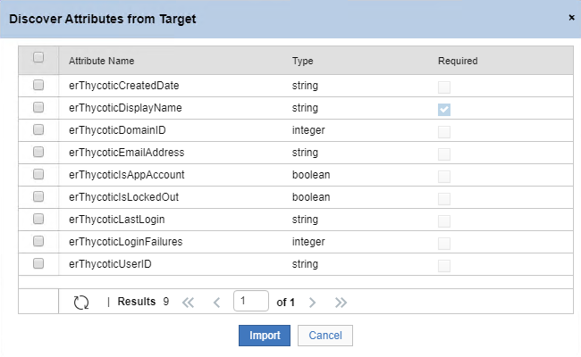
1. Select the __Attribute Name__ check box in the header.

   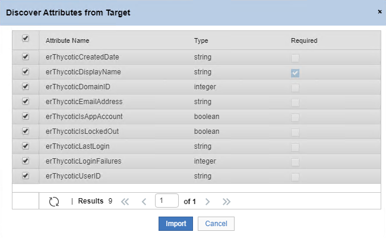
1. Click __Import__. A message, ‘__Operation successfully completed.__’ appears. Click __Ok__. The files are imported.

   
1. On the left-hand side, select the __Users__ tab.

   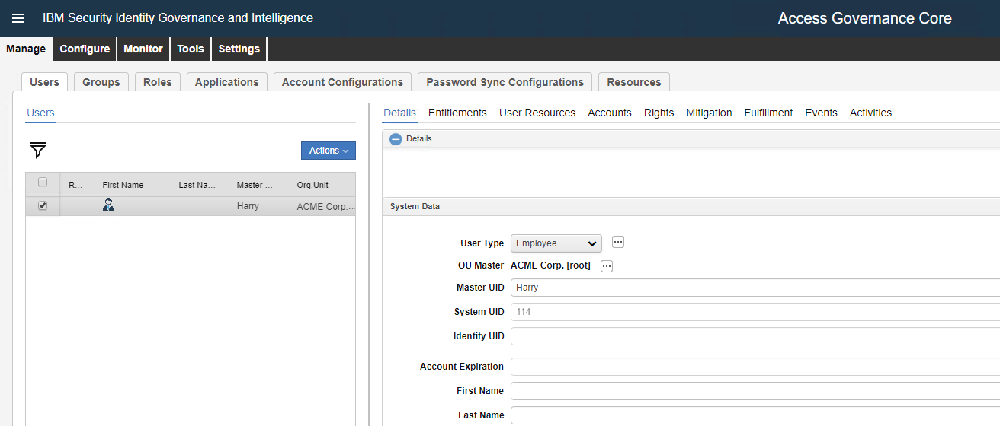
1. Select the user.
1. On the right-hand side, click __Accounts__. The master account is listed.

   
1. In the __Actions__ list, click __Add__.

   
1. The __New Account__ dialog box appears.

   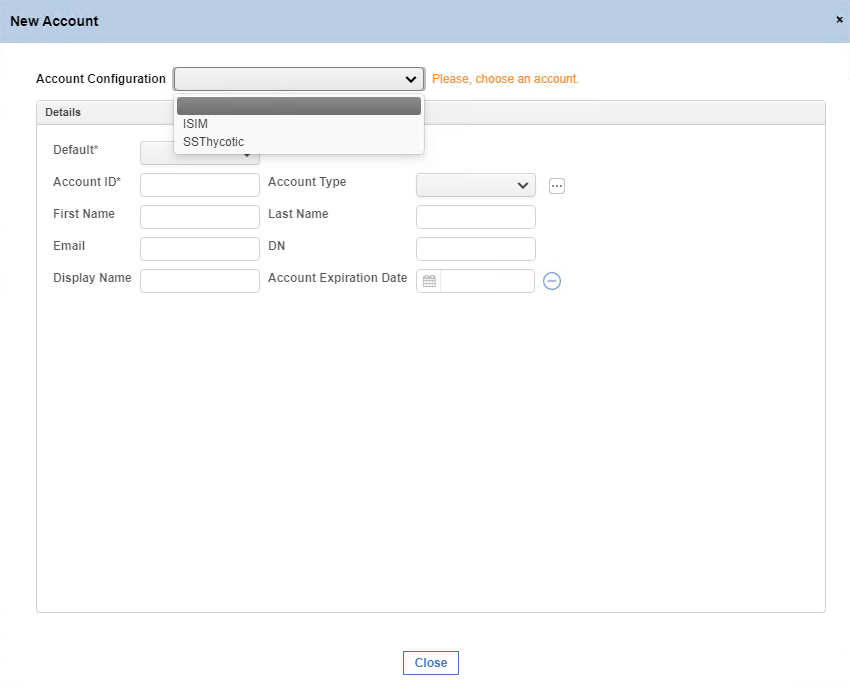
1. In the __Account Configuration__ list, select the Secret Server account. The __Account Creation__ tab is selected.

   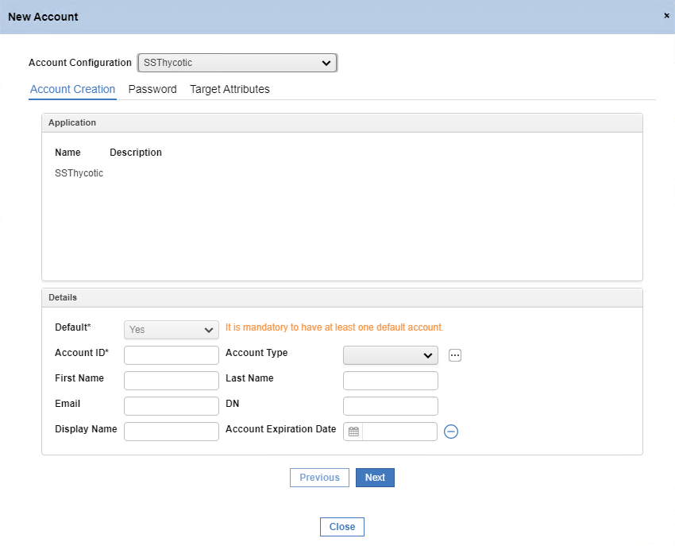
1. Go to  __Account Creation__ tab> __Details__ section > __Account ID__.
1. In the __Account ID__  text box, type the account ID and click __Next__. The __Password__ tab is selected.

   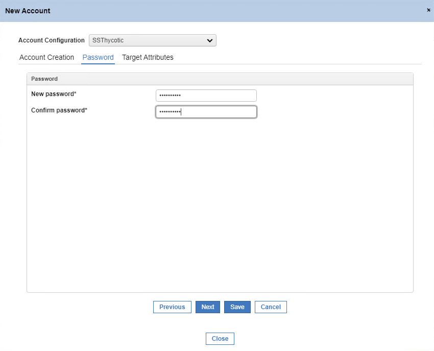
1. Fill in the required information, such as new password, confirm password, and then click __Next__. The __Target Attributes__ tab is selcted.

   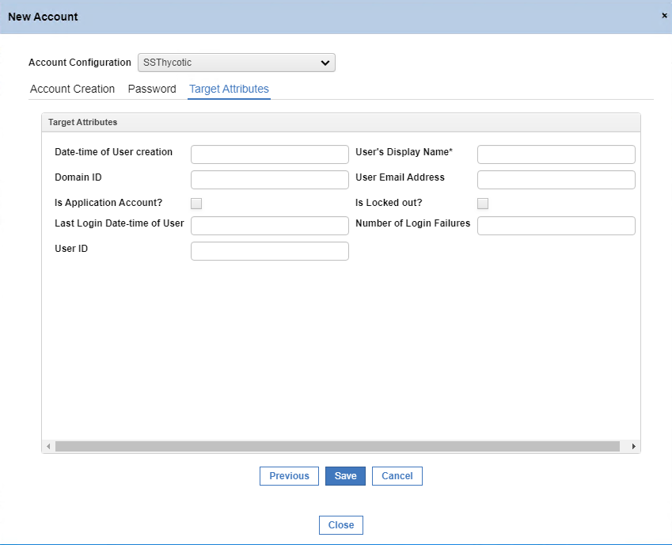
1. In the __User’s Display Name__ text box, type the display name for the user.
1. Click __Save__. The user is listed in the __Accounts__ tab.

   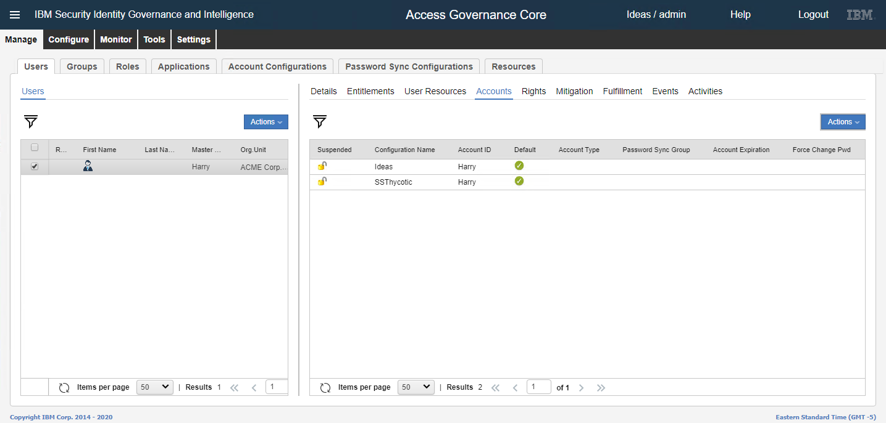
1. Click the __Events__ tab.

   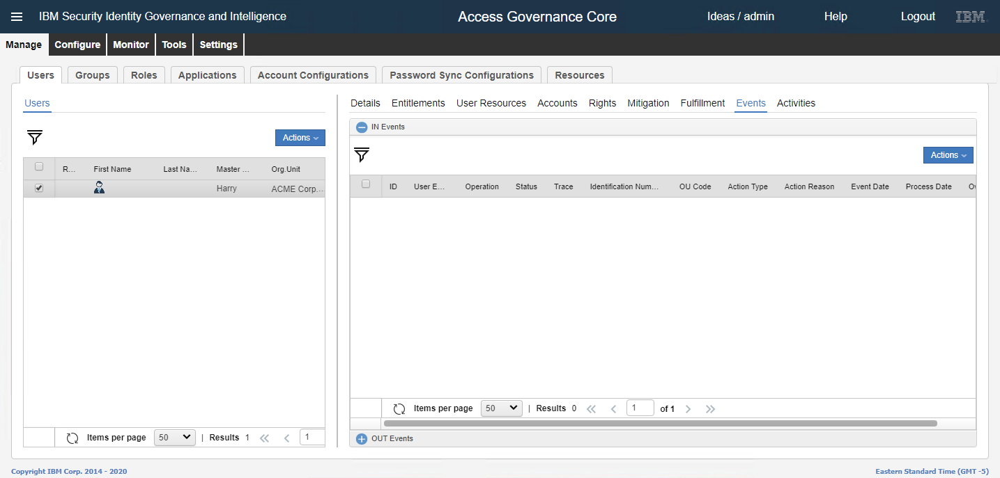
1. At the bottom of the __Events__ tab, click on __OUT Events__. The event is listed. Wait till the __Status__ and the __ERC Status__ is displayed as __Success__.
1. Go to __Secret Server | Admin | Users__.

   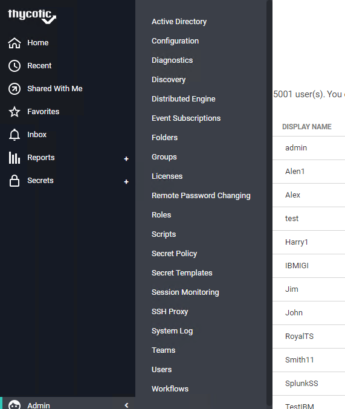
1. The user is created in Secret Server. The user name and the display name for the user is displayed.
1. Go to __IBM IGI Administrator console__ and in the menu click __Access Governance Core__.
1. Click __Manage__ tab __Users | Accounts__.

   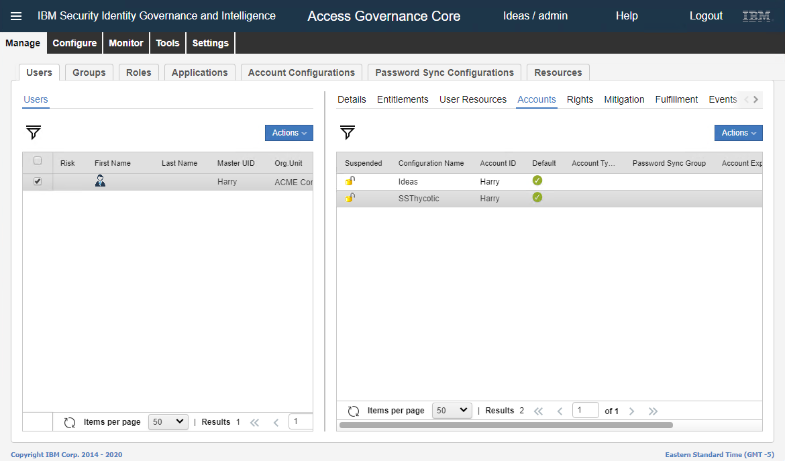
1. Select the account.
1. In the __Action__ list, click __Edit__.

   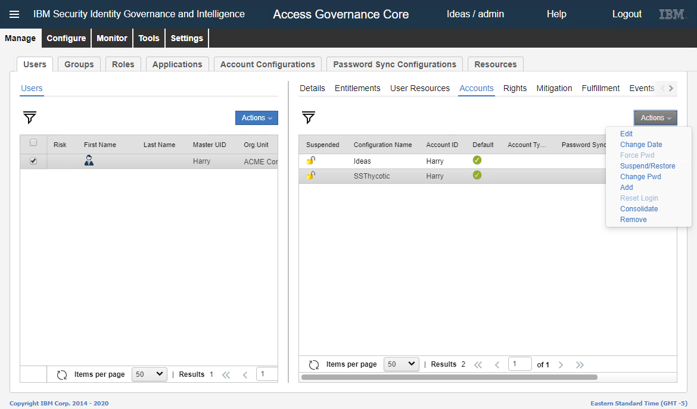
1. The __Edit Account__ dialog box appears.

   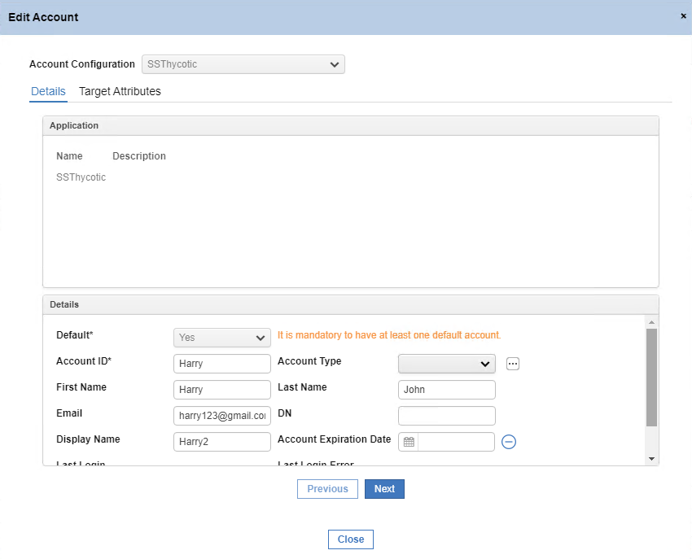
1. Fill in the required information, such as first name, last name, email, display name, and then click __Next__. The __Target Attributes__ tab appears.

   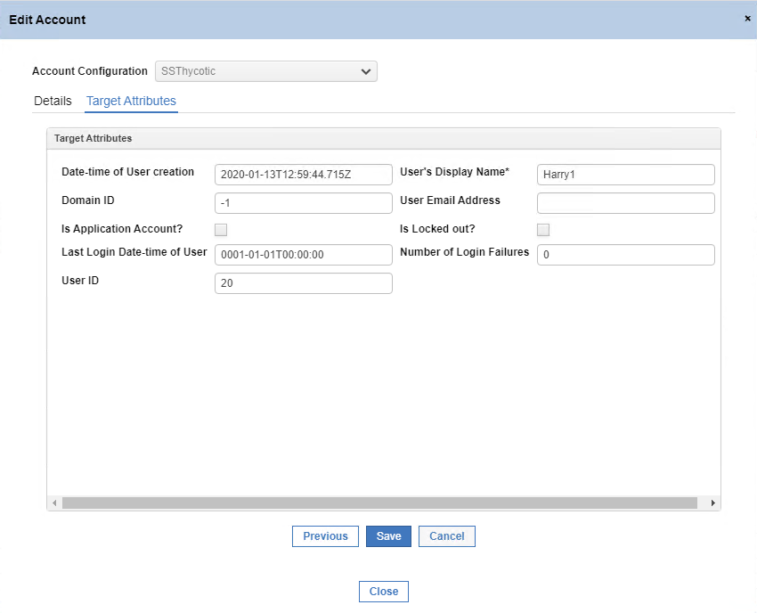
1. In the __User’s Display Name__ text box, change the display name for the user.
1. Click __Save__.
1. Click the __Events__ tab.
1. At the bottom of the __Events__ section, click __OUT Event__.

   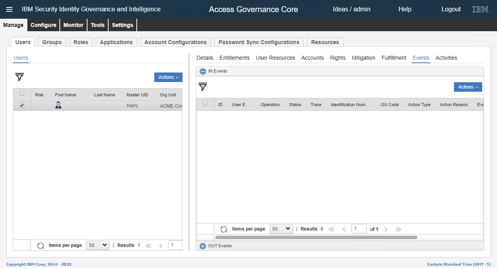

1. The event is listed. Wait till the __Status__ and the __ERC Status__ is displayed as __Success__.

   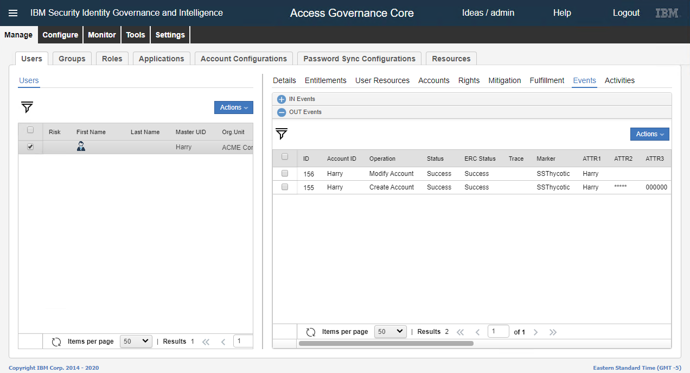
