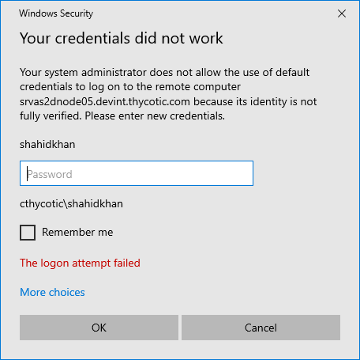
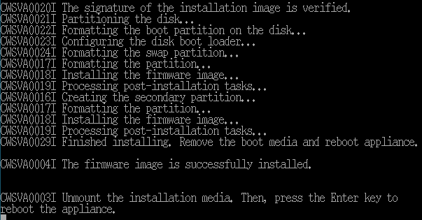
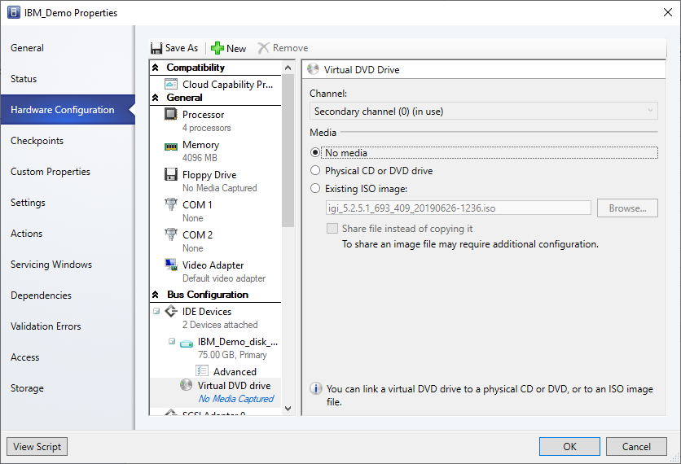

[title]: # (Configuring and Setting Up Virtual Appliance)
[tags]: # (introduction)
[priority]: # (101)
# Step One: Configuring and Setting Up Virtual Appliance for IBM IGI

To integrate IBM IGI with Secret Server, IBM IGI must be installed and configured using a Virtual Appliance. 

Following are the steps:
* Create a Virtual Machine (VM). A VM can be created using tools like VMWare or Hyper-V. For more information, see https://www.ibm.com/support/knowledgecenter/en/SSGHJR_5.2.3/com.ibm.igi.doc/installing/tsk/t_settingup_the_VM.html
*	Set up the Virtual Appliance. The following are the steps to set up a Virtual Appliance:
      * [Install firmware](#Install-firmware)
      * [Set up properties for VM](#Setup-properties-for-VM)
  * [Install IBM IGI](#Install-IBM-IGI)
  
  * [Set up IBM IGI](#Setup-IBM-IGI)
  
  * [Configure OpenID Connect Provider](#Configure-OpenID-Connect-Provider)
 
The detailed procedure for each step is explained below.

## Set up the Virtual Appliance

The following are the steps to set up a Virtual Appliance:

 * [Install firmware](#Install-firmware)
 * [Set up properties for VM](#Setup-properties-for-VM)

### Install firmware
After creating a VM, the firmware must be installed.

**To install the firmware on the VM:**
1. On the VM window, right-click the name of the Virtual Machine created and click **Power On**.

     

2. Right-click the name of the VM and click **Connect or View** > **Connect via Console**. 

     

    The **Windows Security** dialog box appears.

    

3. Type a password and click **OK**. The Console view appears.

     

4. Select the language to be used during the installation as `English` and press **Enter**.

     

5. To proceed, type `yes` and press **Enter**.

     

The firmware is successfully installed. After installation is completed, the process prompts to reboot the appliance. Before rebooting the appliance, some properties are to be set.

### Set up properties for VM
You need to set up the properties for hardware configuration.

**To set up properties for VM:**
1. On the VM window, right-click the name of the VM created and click **Properties**.

     

2. Click **Hardware Configuration** > **Virtual DVD drive**.

     

3.	In the **Media** area, select **No media** and click **OK**. The VM gets updated.
4.	Go to Virtual Appliance and press **Enter** to reboot.

     

The VM properties are set successfully. Now, IBM IGI is to be installed.
