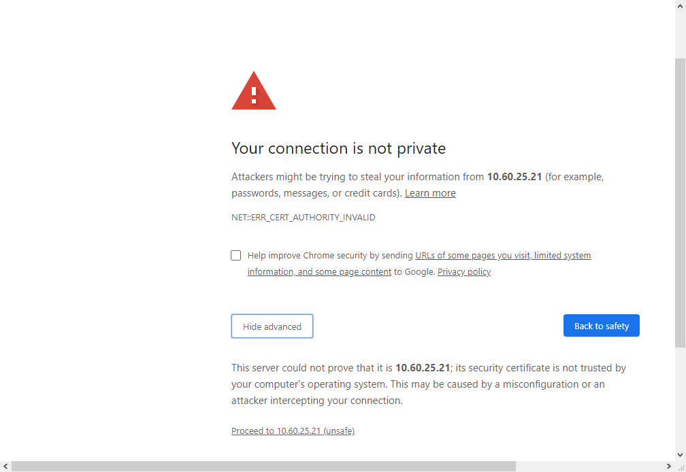
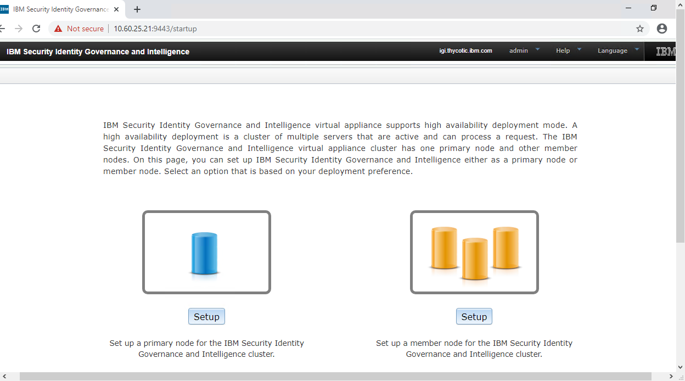
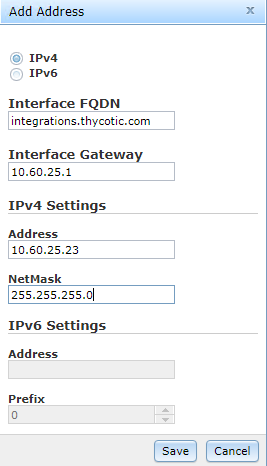
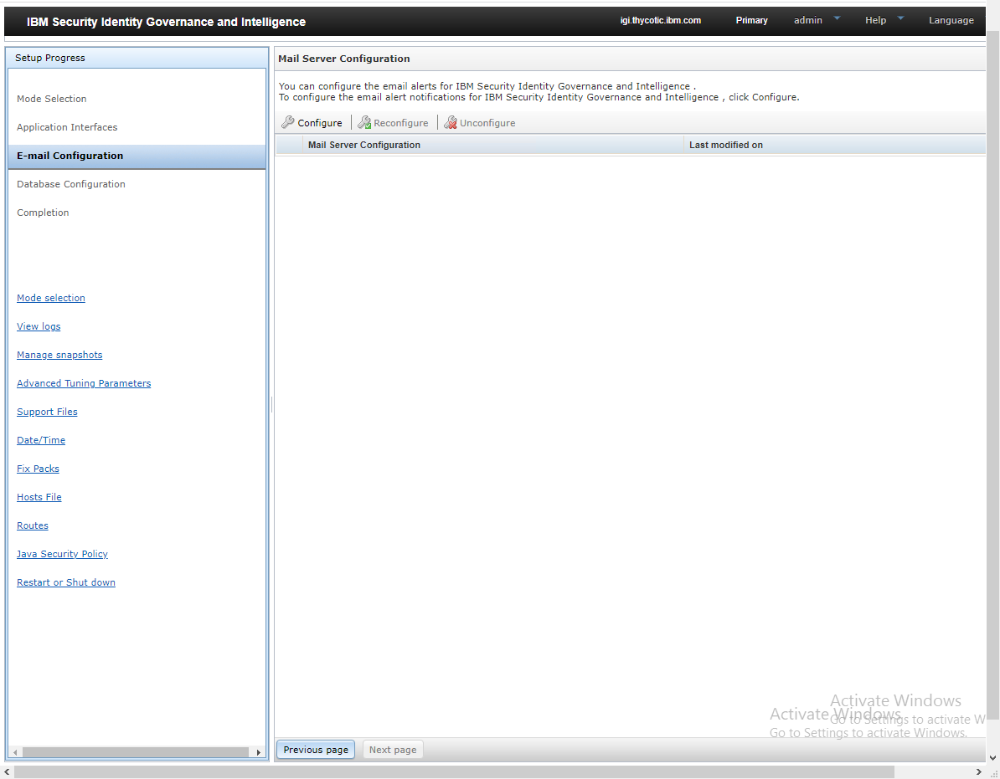
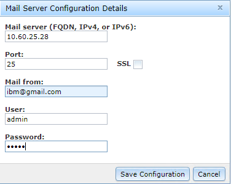
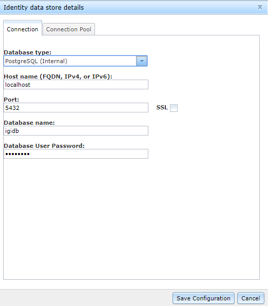
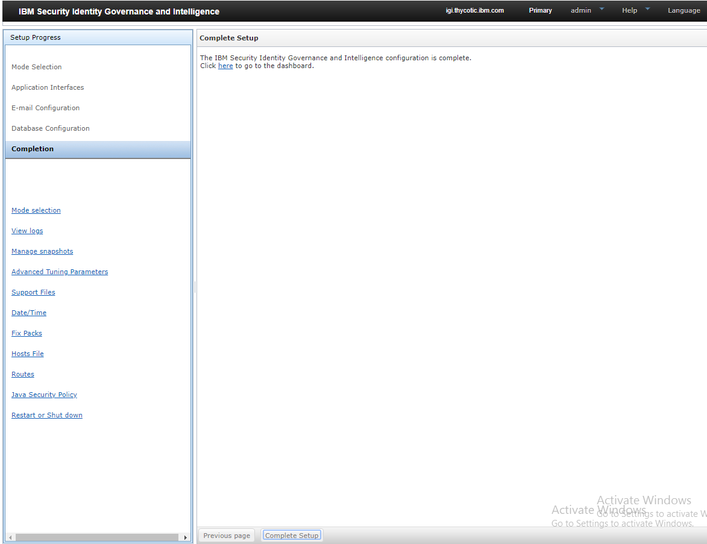
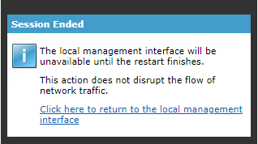
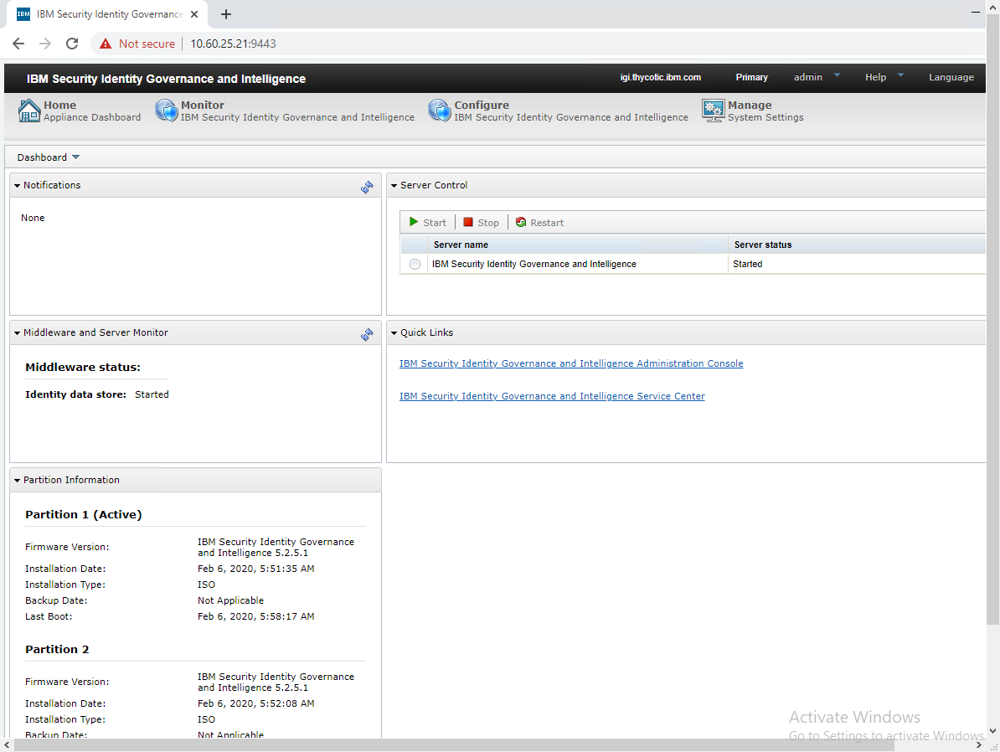

[title]: # (How to set up IBM IGI)
[tags]: # (introduction)
[priority]: # (103)
# How to set up IBM IGI

This section provides the steps to set up IBM IGI.

__To set up IBM IGI:__

1. In the __igi.thycotic.ibm.com__ domain name, enter login and password details.

1. Type the `IP address` along with the port number (For example: 10.60.25.21:9443) in the browser and press __Enter__.

   >**Note:** The default port number is 9443.

   

1. Click __Advanced__.
1. Click __Proceed to `IP Address` (unsafe)__.

   

1. The IBM IGI Login page appears.

   
1. Fill in the required information, such as the user name, password, and click __Login__. The __IBM Security Identity Governance and Intelligence__ page appears.

   >__Note:__ The default value for user name is `admin`. The value of the password is what you have changed in the Console window.

   
1. Click __Setup__ for setting up a primary node for the IBM Security Identity Governance and Intelligence cluster. The __IBM IGI setup wizard__ appears.

   
1. In the __Mode Selection__ page, click __Next page__. The __Application Interfaces__ page appears.

   
1. In the __Application Interfaces__ page, click the __New__  icon. The __Add Address__ dialog box appears.
1. In the __Add Address__ dialog box, fill in the required information.

   

    * __IPv4__ - Select the required option.

    * __Interface FQDN__ - Type the fully qualified domain name.

    * __Interface Gateway__ - Type the interface gateway details.

    * __IPv4 Settings - Address__ - Type the IP Address.

   >**Note:** Ensure the IP Address is not assigned to any other computer.

    * __IPv4 Settings - NetMask__ - Type the netmask details.

1. Click __Save__. A message “__The new application address is added successfully.__” appears and the IP Address is listed.

   
1. Click __Next page__. The __Mail Server Configuration__ page appears.

   
1. Click the __Configure__  icon. The __Mail Server Configuration Details__ dialog box appears.
1. In the __Mail Server Configuration Details__ dialog box, fill in all the information.

   
1. Click __Save Configuration__. A message, ‘__Mail server configuration added.__’ appears and the email configuration is listed.

   
1. Click __Next page__. The __Database Server Configuration__ page appears.

   
1. Click the __Configure__  icon. The __Identity data store__ details dialog box appears.
1. In the __Connection__ tab, fill in all the information.

   
1. Click __Save Configuration__. A message,'__Identity data store configuration created.__ 'appears and the database configurations are displayed.

   
1. Click __Next page__.

   
1. In the __Complete Setup__ page, click __Complete Setup__. The progress bar of the setup appears.

   
1. The __Complete Setup__ page appears.

   
1. After the completion of the setup, click `here` in the sentence `Click here to go to the dashboard`. The __Session Ended__ dialog box appears.

   
1. In the __Session Ended__ dialog box, click the sentence `Click here to return to the local management interface`. The IBM IGI dashboard appears.

   >**Note:** If the IBM IGI dashboard does not appear, type the IP address along with the port number (For example: 10.60.25.21:9443) in the browser and press Enter. If required, replace the domain name with the IP Address.

   
1. Close the session.
