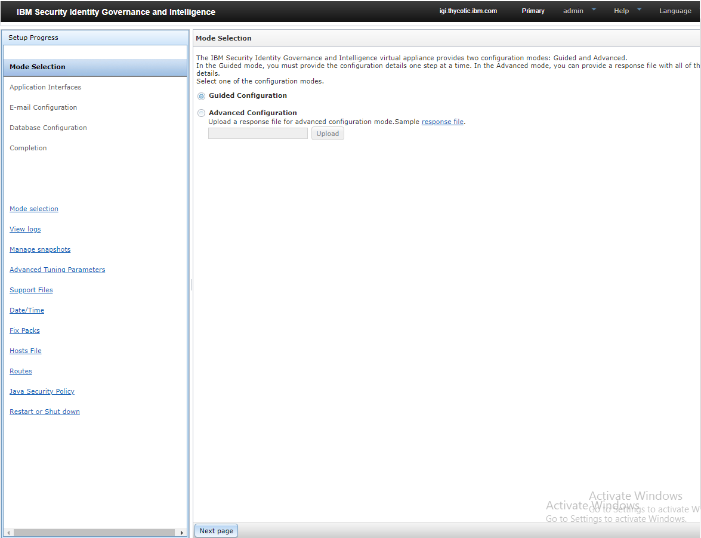
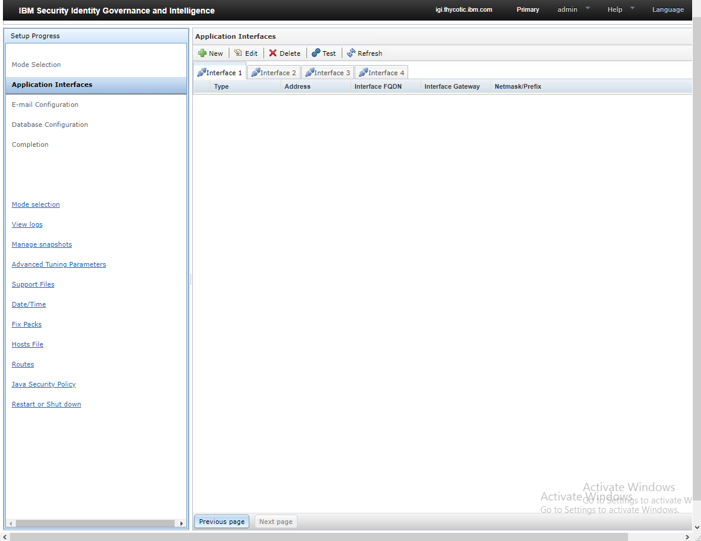
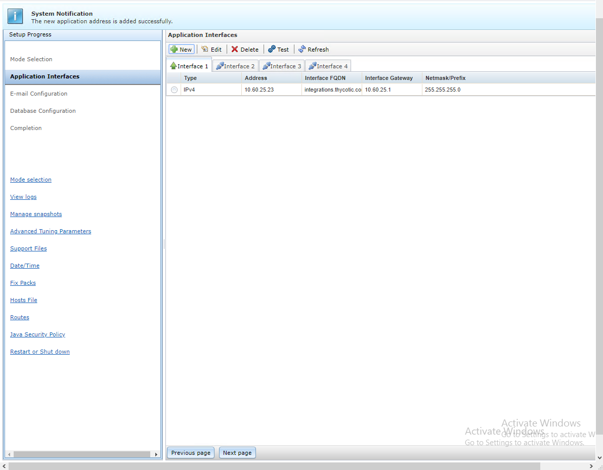
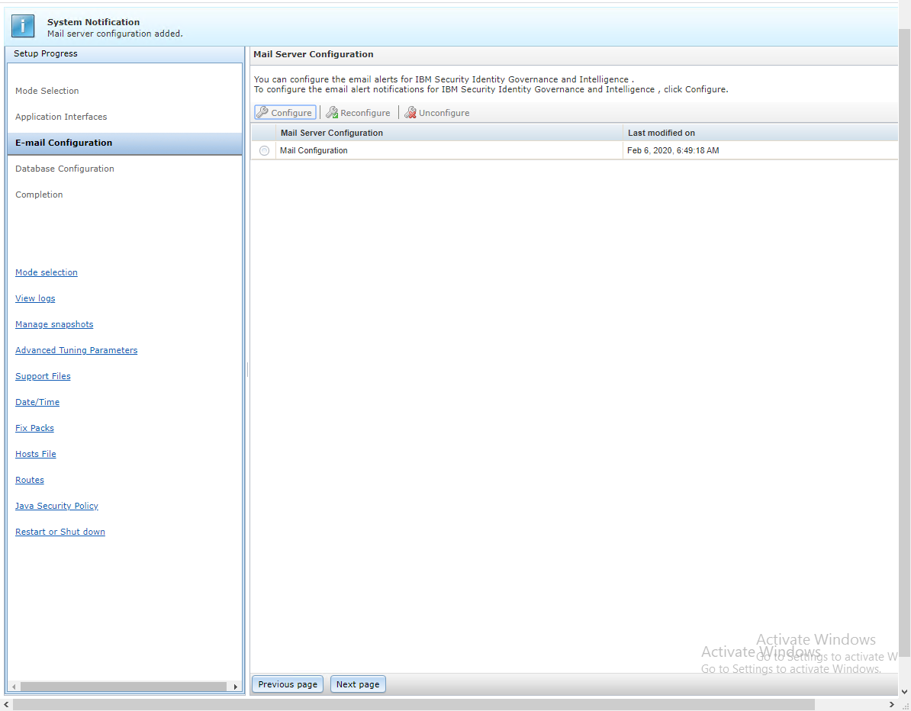
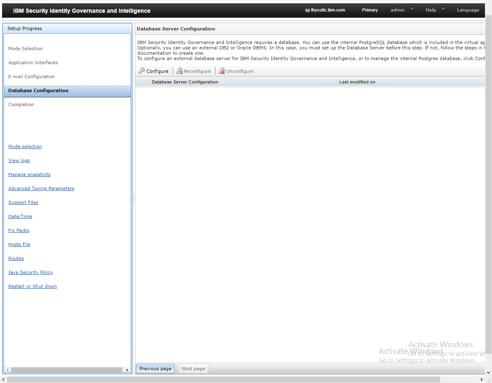
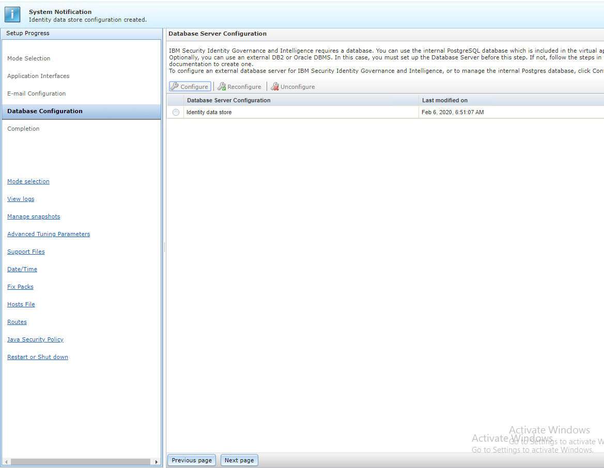
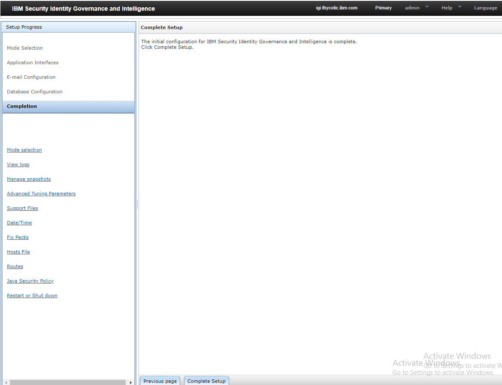
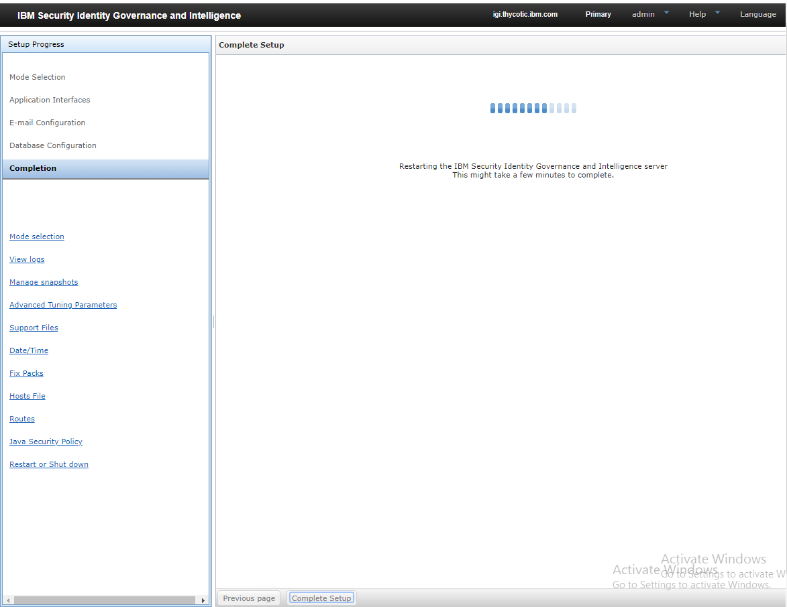

[title]: # (How to set up IBM IGI)
[tags]: # (introduction)
[priority]: # (103)
# How to set up IBM IGI

## Set up IBM IGI
This section provides the steps to set up IBM IGI.

**To set up IBM IGI:**

1. In the **igi.thycotic.ibm.com** domain name, enter login and password details. 

2. Type the `IP address` along with the port number (For example: 10.60.25.21:9443) in the browser and press **Enter**.

     >**Note**: The default port number is 9443.

     

3.	Click **Advanced** and click **Proceed to `IP Address` (unsafe)**.

     

      The IBM IGI Login page appears.
 
      

4.	Fill in the required information, such as the user name, password, and click **Login**. The **IBM Security Identity Governance and Intelligence** page appears.
     >**Note:** The default value for user name is `admin`. The value of the password is what you have changed in the Console window.

     

5. Click **Setup** for setting up a primary node for the IBM Security Identity Governance and Intelligence cluster. The **IBM IGI setup wizard** appears.

     

6.	In the **Mode Selection** page, click **Next page**. The **Application Interfaces** page appears.

     

7.	In the **Application Interfaces** page, click the **New**  icon. The **Add Address** dialog box appears.

8.	In the **Add Address** dialog box, fill in the required information.

    

    * **IPv4** - Select the required option.
    
    * **Interface FQDN** - Type the fully qualified domain name.
    
    * **Interface Gateway** - Type the interface gateway details.

    * **IPv4 Settings - Address** - Type the IP Address.
    
       >**Note**: Ensure the IP Address is not assigned to any other computer.
    
    * **IPv4 Settings - NetMask** - Type the netmask details.
9.	Click **Save**. A message “**The new application address is added successfully.**” appears and the IP Address is listed.

     

10.	Click **Next page**. The **Mail Server Configuration** page appears.

     

11.	Click the **Configure**  icon. The **Mail Server Configuration Details** dialog box appears.

12.	In the **Mail Server Configuration Details** dialog box, fill in all the information.

     

13.	Click **Save Configuration**. A message, ‘**Mail server configuration added.**’ appears and the email configuration is listed. 

     

14.	Click **Next page**. The **Database Server Configuration** page appears.

      

15.	Click the **Configure**  icon. The **Identity data store** details dialog box appears.
16.	In the **Connection** tab, fill in all the information.
    
     

 17.	Click **Save Configuration**. A message,'**Identity data store configuration created.** 'appears and the database configurations are displayed.   
  
     

18.	Click **Next page**.
 
      

19. In the **Complete Setup** page, click **Complete Setup**. The progress bar of the setup appears.

     

     The **Complete Setup** page appears.

     

20. After the completion of the setup, click `here` in the sentence `Click here to go to the dashboard`. The **Session Ended** dialog box appears.

      
21. In the **Session Ended** dialog box, click the sentence `Click here to return to the local management interface`. The IBM IGI dashboard appears.

    >**Note**: If the IBM IGI dashboard does not appear, type the IP address along with the port number (For example: 10.60.25.21:9443) in the browser and press Enter. If required, replace the domain name with the IP Address. 

     

22. Close the session.

The IBM IGI setup is completed successfully. Now, the OpenID Connect Provider is to be configured.