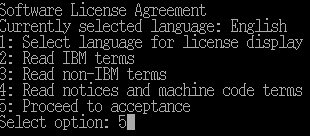
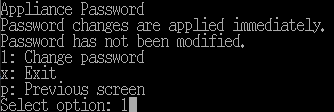
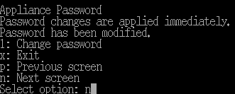
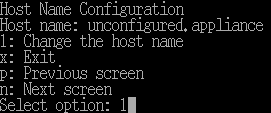
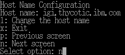
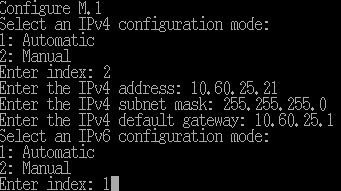
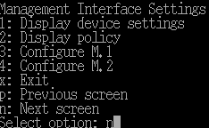
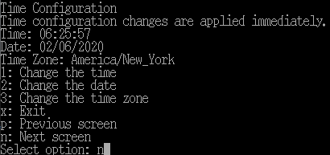
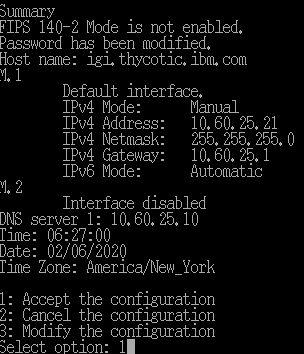
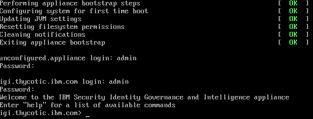

[title]: # (Configuring and Setting Up Virtual Appliance)
[tags]: # (introduction)
[priority]: # (101)
# Install IBM IGI

## Install IBM IGI
This section provides the steps to install IBM IGI.

**To install IBM IGI:**
1.	Type the login credentials. The **IBM Security Identity Governance and Intelligence setup wizard** appears.
     >**Note:** The default value for login and password is `admin`.

     

2.	Press **Enter** to continue. The **Software License Agreement** appears.

     

3.	In the **Software License Agreement**, select the option **Proceed to acceptance**.

     

4.	Select the option **I agree** to suggest that you agree that you have had the opportunity to review the terms of both the IBM and non-IBM licenses presented and such terms govern this transaction.

     

5.	Under **FIPS 140-2 Mode Configuration**, select the option **Next screen** . 

     

6.	Under **Appliance Password**, select the option **Change password** .

     

7. Under **Change Password**, fill in the required information, such as old password, new password, and confirm new password. The ‘**Password successfully changed.**’ message appears.

     

8.	Under **Appliance Password**, select the option **Next screen**.

     

9.	Under **Host Name Configuration**, select the option **Change the host name**.

     

10.	Under **Change the Host Name**, enter the FQDN host name. (For example: igi.thycotic.ibm.com )

     

11.	Under **Host Name Configuration**, select the option **Next screen**.

     

12.	Under **Management Interface Settings**, select the option **Configure M.1**.

     

13.	Under **Configure M.1**, select the option **Manual**.

     

14.	Fill in the required information, such as type the IPV4 address, IPV4 subnet mask, IPV4 gateway, and then select **IPV6 configuration mode** as **Automatic**.
 
      

15. In the **Management Interface Settings**, select the option as **Next screen**.

      

16. In **DNS Configuration**, select the option **Set DNS server 1**.

      

17. In **Set DNS server 1**, type the DNS server IP address. 

     

18. In **DNS Configuration**, select the option **Next screen**.

     

19. In **Time Configuration**, select the option **Next screen**.

     

20. In **Summary**, select the option **Accept the configuration**. After applying the policy changes, a message, ‘**Policy changes were successfully applied. Local Management Interface has been restarted.**’ appears. 

     
 
      The **IBM IGI** appliance login page appears.

     

IBM IGI is successfully installed. Now, let us set up  IBM IGI.