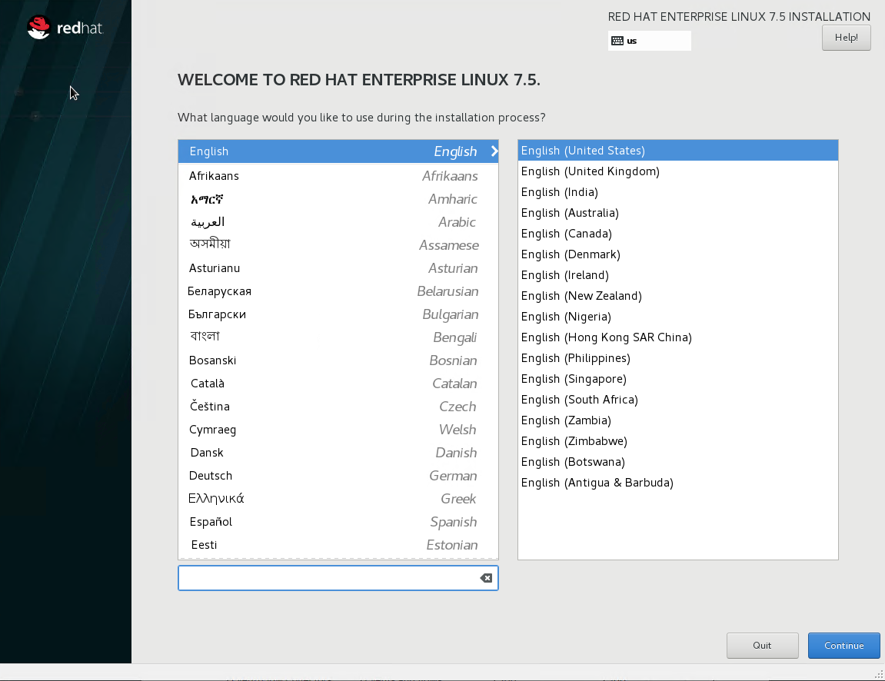
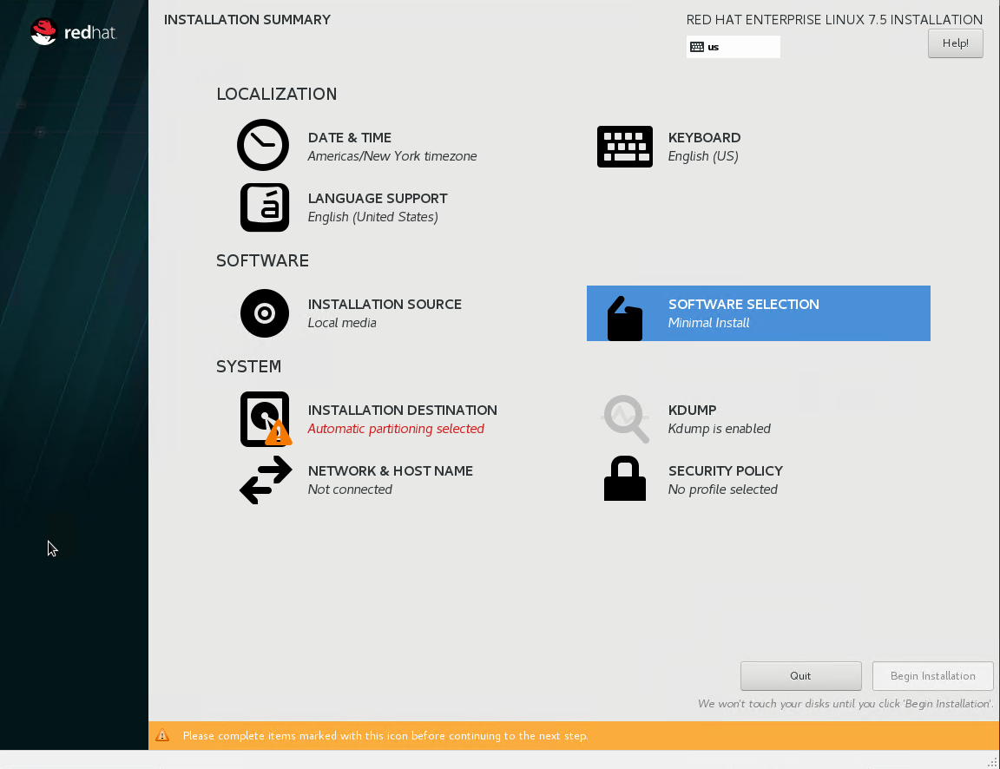
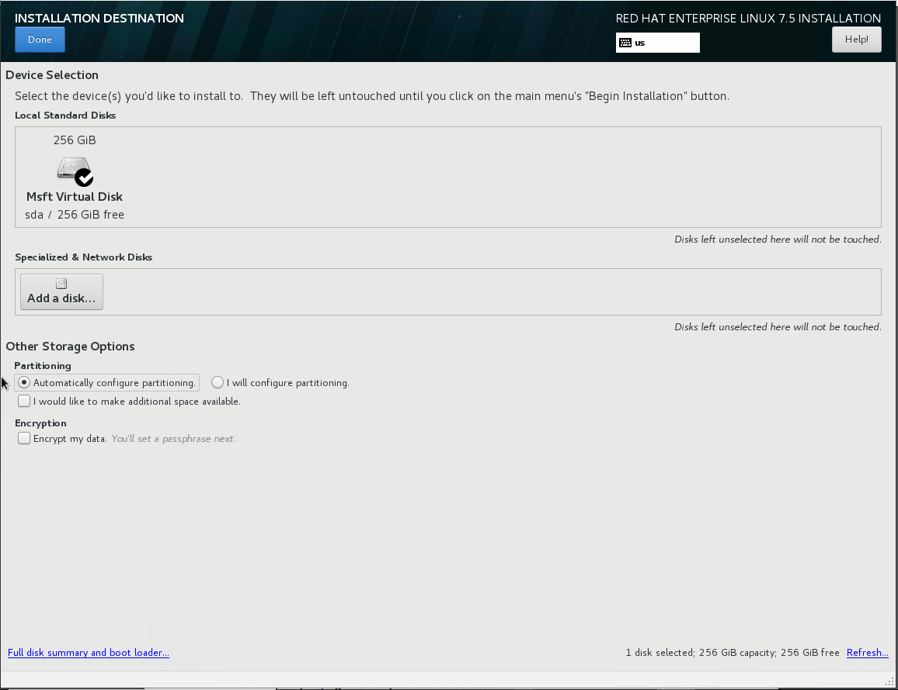
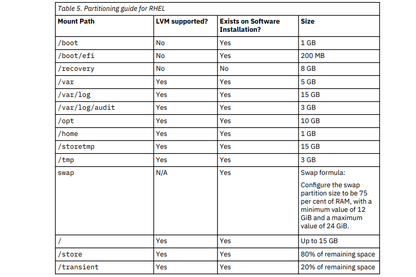
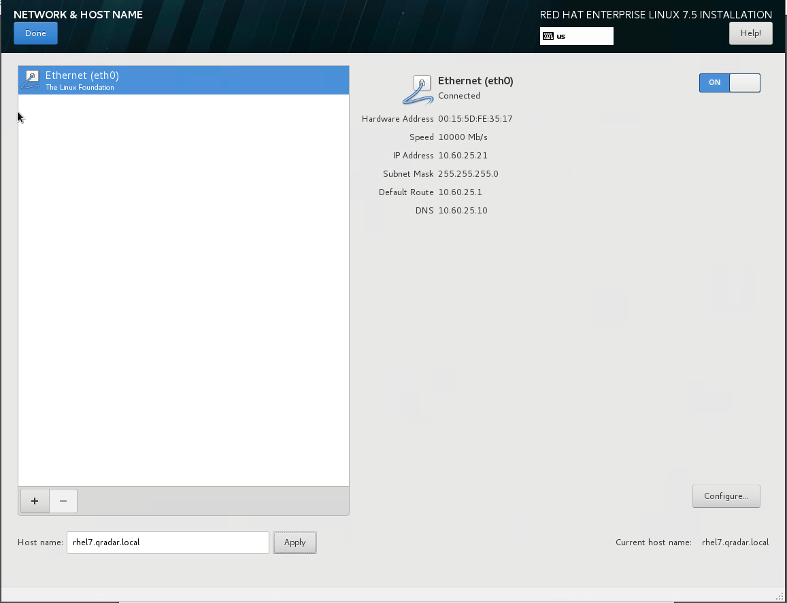
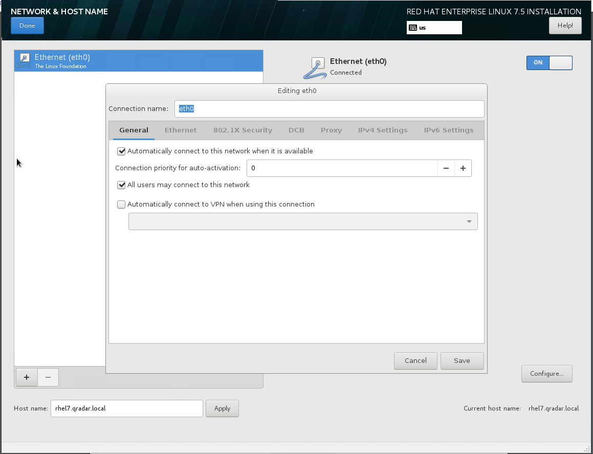
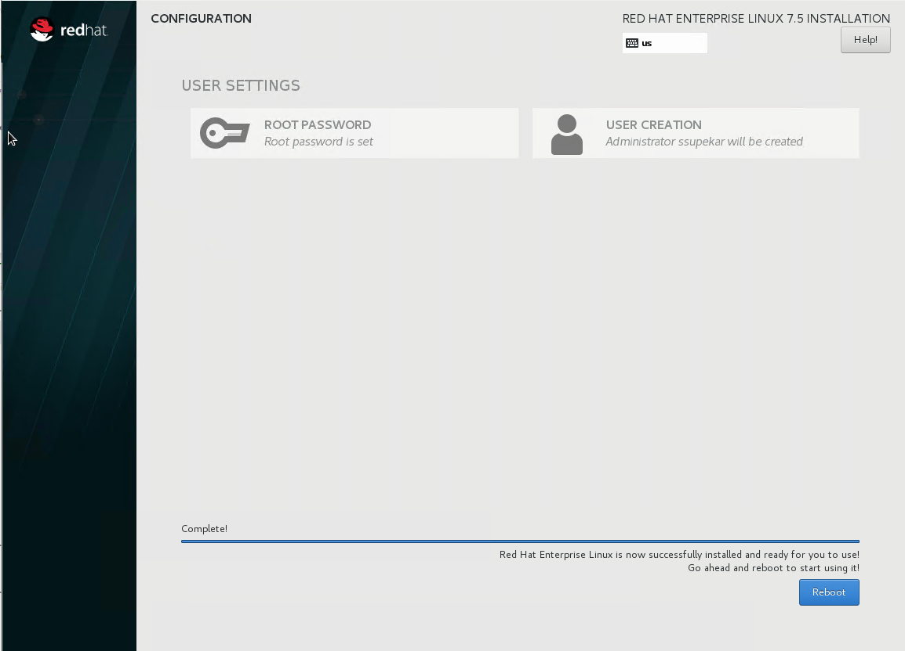
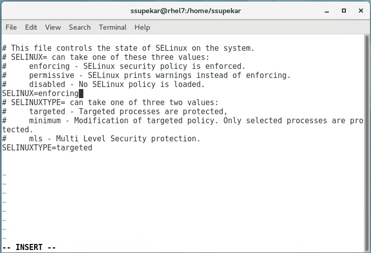
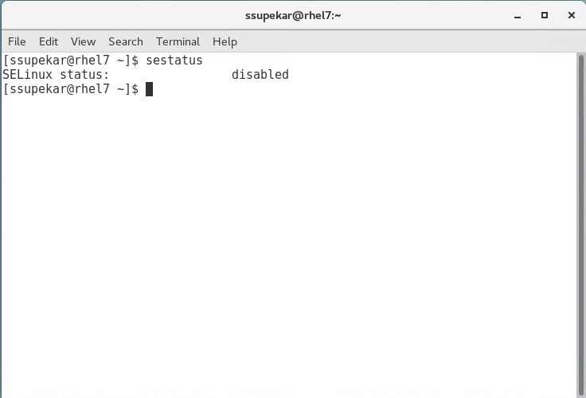

[title]: # (Installing Red Hat Enterprise Linux on your hardware)
[tags]: # (introduction)
[priority]: # (3)
[display]: # (none)
# Installing Red Hat Enterprise Linux on your hardware

<!-- add and overview of covered troubleshooting topics 

This section might not be needed depending on scope/complexity of integration.-->

You can install the Red Hat Enterprise Linux (RHEL) operating system on your hardware to use with IBM QRadar. Before you begin Download the Red Hat Enterprise Linux Server 7.5 x86_64 Boot ISO from https://access.redhat.com.

1. Copy the Red Hat Enterprise Linux minimal ISO to a DVD or a bootable USB
    flash drive.

1. Insert the portable storage device into your appliance and restart your appliance.

1. From the starting menu, do one of the following options:

1. Select the USB or DVD drive as the boot option.

1. To install on a system that supports Extensible Firmware Interface (EFI), you must start the system in legacy mode.
1. When prompted, log in to the system as the root user.

## Instructions for the Installation Wizard

1. Set the language to English (US).  

   

1. Click __Date & Time__ and set the time for your deployment.
1. Then click on __Software Selection__.

   

1. Click Installation Destination and select the I will configurepartitioning option.  
1. Then click on Virtual __Disk | Done__.

   

1. Select LVM in the drop-down list.
1. Click the Add button to add the mount points and capacities for your partitions, and then click Done. For more information about RHEL7 partitions, see [Linux operating system partition properties for QRadar installations on your own hardware](https://www.ibm.com/support/knowledgecenter/SS42VS_7.3.1/com.ibm.qradar.doc/r_siem_inst_part_guide.html?view=kc).  

   

1. Click Network & Host Name.  

   

1. Enter the host name for your appliance.

1. Select the interface in the list, move the switch to the ON position, and click Configure.

1. On the General tab, select the Automatically connect to this network when it is available option.

1. On the IPv4 Settings or IPv6 Settings tab, select Manual in the Method list.

1. Click Add.

   * For an IPv4 deployment, enter the IP address, Netmask, and Gateway for the appliance in the Addresses field.

   * For an IPv6 deployment, enter the IP address, Prefix, and Gateway in the Addresses field.

1. Add two DNS servers.

1. Click __Save | Done | Begin Installation__.  

   

1. Set the root password, and then click Finish configuration.  

   

1. Disable SELinux and restart the appliance after the installation finishes.

## Procedure to remove and disable SELinux security features

1. Log in to your server

1. Check the current SELinux status, run: **sestatus**

   

1. To disable SELinux on Redhat linux, run:
    `vi /etc/sysconfig/selinux`

1. Edit the /etc/selinux/config file and set the SELINUX to disabled

1. Reboot the Linux server

1. Verify it by running the sestatus and getenforce again

   
