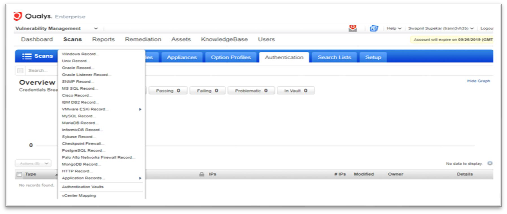

[title]: # (Creating Authentication Records)
[tags]: # (authentication)
[priority]: # (102)
# Creating Authentication Records

>   Once the authentication vault has been configured, individual authentication
>   credentials can be configured to retrieve their passwords from Secret
>   Server.

#### Authentication \> New \> record type.

>   Authentication vault configuration requires three additional details to
>   retrieve the password:

-   **Vault Type**: Set to Thycotic Secret Server.

-   **Vault Title**: The previously created Authentication Vault record in
    Qualys.

-   **Secret Name**: The Secret record in Secret Server containing the accounts
    password. In this case, the Secret name for the Windows account is
    Qualystest.

1.  Navigate to **Scan** \> **Authentication**.

2.  Click on **New** dropdown and select **Windows Record**.

>   **Note**: The Secret name must match the corresponding Secret name in Secret
>   Server.

>   In addition to creating a Secret with the correct password for the
>   credentials used for authenticated scanning, the Qualys user account must be
>   granted at least View access to the Secret.

1.  Click **Share** to view the permissions on the Secret.

>   A Secret inherits permissions from the folder settings. View the folder
>   level permissions by editing the folder in which the Secret is stored.

>   Once the Secret is configured with the proper permission, Qualys can use it
>   in scans. Run a scan that uses that authentication record to verify that
>   everything is working end-to-end.