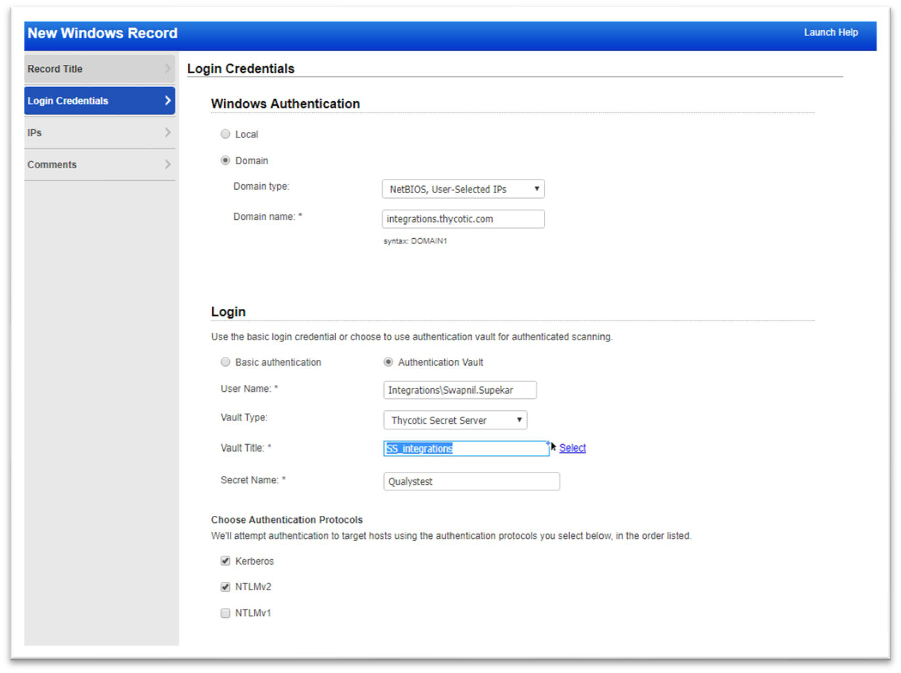

[title]: # (Creating Authentication Records)
[tags]: # (authentication)
[priority]: # (102)
# Creating Authentication Records

Once the authentication vault has been configured, individual authentication credentials can be configured to retrieve their passwords from Secret Server.

1. __Authentication | New | record type__.

Authentication vault configuration requires three additional details to retrieve the password:
* __Vault Type__: Set to Thycotic Secret Server.
* __Vault Title__: The previously created Authentication Vault record in
    Qualys.
* __Secret Name__: The Secret record in Secret Server containing the accounts password. In this case, the Secret name for the Windows account is Qualystest.

   
2. Navigate to __Scan__ \> __Authentication__.

3. Click on __New__ dropdown and select __Windows Record__.

   

   >**Note:** The Secret name must match the corresponding Secret name in Secret Server.

   

In addition to creating a Secret with the correct password for the
credentials used for authenticated scanning, the Qualys user account must be granted at least View access to the Secret.

4. Click __Share__ to view the permissions on the Secret.

   

A Secret inherits permissions from the folder settings. View the folder level permissions by editing the folder in which the Secret is stored.

Once the Secret is configured with the proper permission, Qualys can use it in scans. Run a scan that uses that authentication record to verify that everything is working end-to-end.