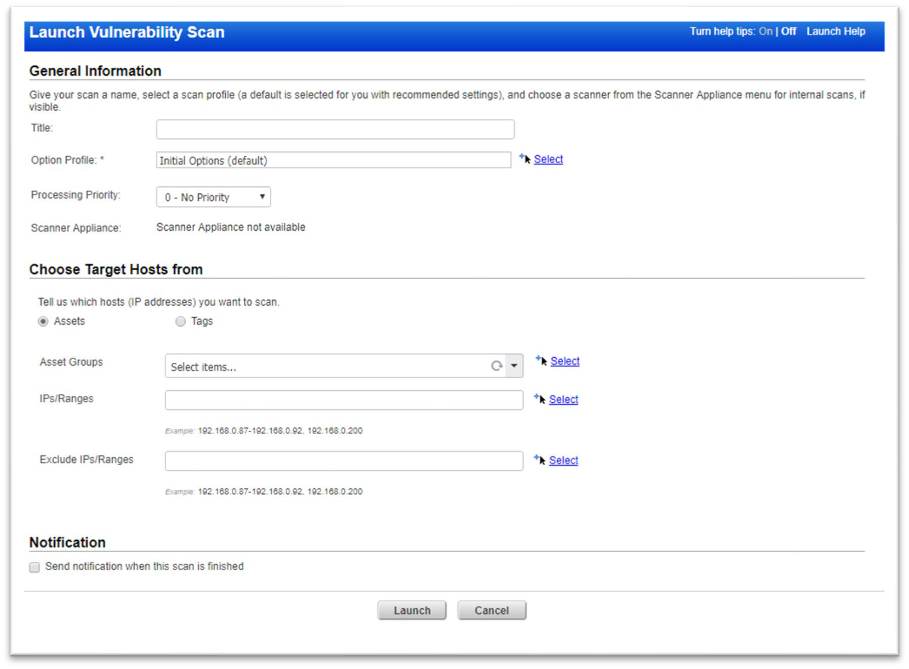
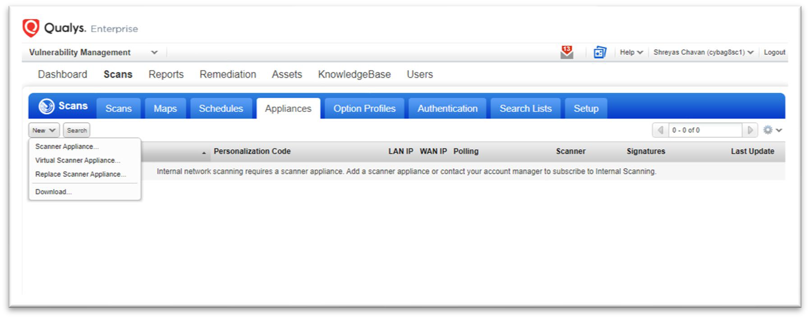
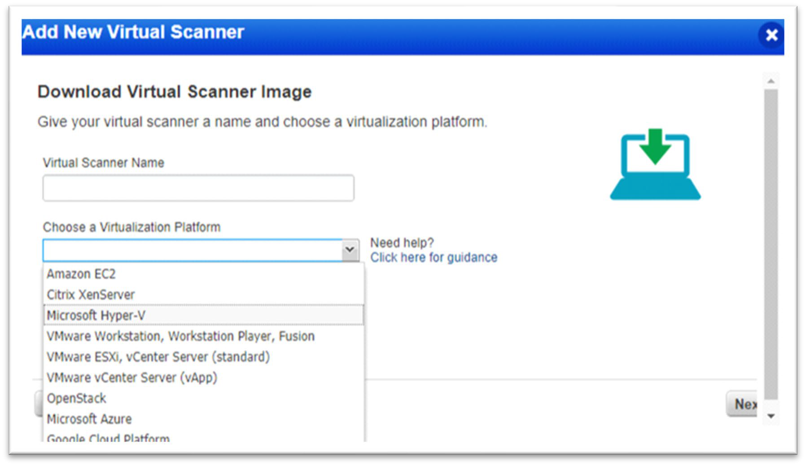
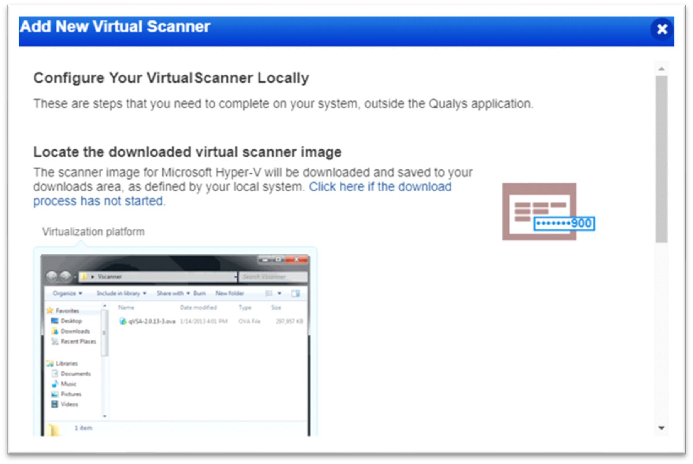
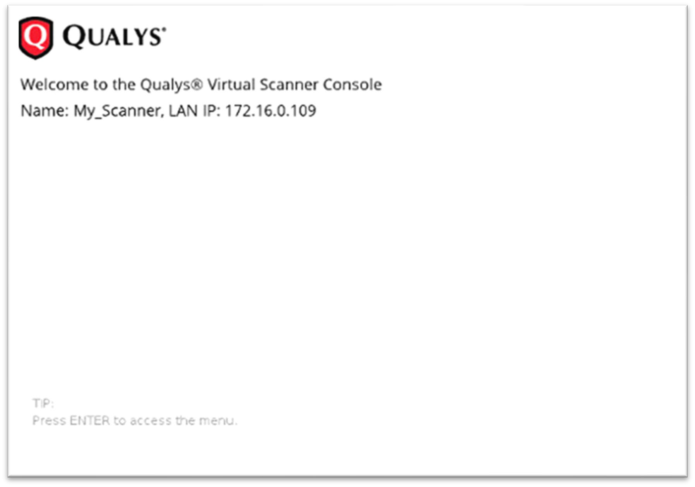
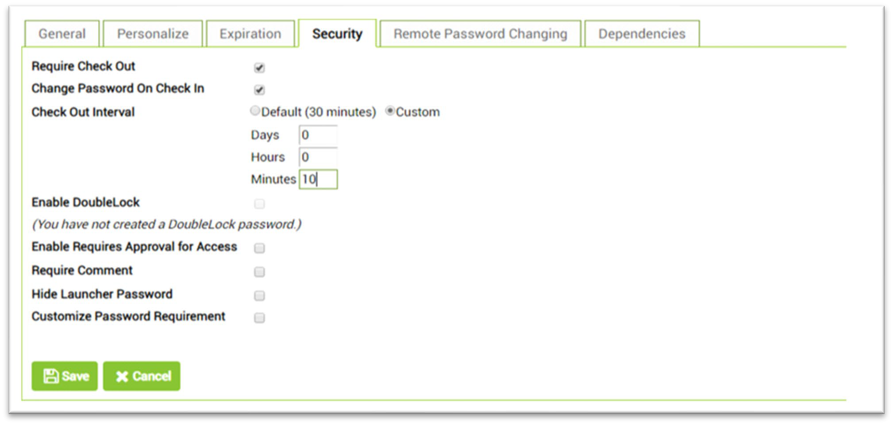

[title]: # (Scan for Vulnerabilities)
[tags]: # (scan, vulnerabilities)
[priority]: # (103)
# Scan for Vulnerabilities

>   It is important to scan your systems for known vulnerabilities to understand
>   security risk. By automating scans, you'll get up to date security
>   intelligence in real time.

### Launch a Vulnerability Scan

1.  Navigate to **Scans** \> **Scans** \> **New** \> **Scan** (or Schedule
    Scan). The Launch Vulnerability Scan window will open.

>   **Note**: If Scanner Appliance: field reads *Scanner Appliance not
>   available,* it must be set up.

### Set up Scanner Appliance

1.  Navigate to **Scans** \> **Appliances** \> **Select** option.

1.  Navigate to **Scans** \> **Appliances** \> New \> Virtual Scanner Appliance.

1.  Click **Start Wizard**.

2.  Enter the scanner name and select **the preferred virtualization platform**.

1.  Download the **Virtual Scanner Image**.

>   **Note**: This step applies to virtualization platforms with a scanner
>   appliance image download (e.g. for VMware, Citrix XenServer, etc.)

1.  Locate the Virtual Scanner Image on your local system.

>   A screenshot of a social media post Description automatically generated

1.  Copy the **Personalization code** to a safe place as it will be required
    later.

1.  Personalize Your Scanner Local system or server.

>   These steps apply when you have downloaded a scanner appliance image (i.e.
>   for VMware, Citrix XenServer, etc.). You’ll use Virtual Scanner Console
>   running on your virtualization software to complete these steps.

Configure a Virtual Scanner using Microsoft Hyper-V
---------------------------------------------------

>   **Note**: The following steps assume you have downloaded the virtual scanner
>   image (qVSA-2.0.13-1- vhd.zip or later) and obtained a personalization code
>   as noted in the above sections.

1.  Start the virtual scanner machine.

2.  Unzip the downloaded file: qVSA.i386-2.4.26-11.vhd.zip to obtain the virtual
    hard disk file: qVSA.i386-2.4.26-11.vhd.zip.

3.  Log in to the Hyper-V server.

4.  Navigate to **Manager** \> **Hyper-V Manager** \> **add a new Virtual
    Machine**.

5.  Provide a name for the scanner.

6.  Configure the memory. (Recommended is 2048 MB or more.)

7.  Configure the networking as appropriate so the network adapter on the
    scanner can use a virtual network for communication.

8.  For the virtual hard disk configuration, select **Use an existing virtual
    hard disk** and provide the location of the .vhd file obtained from the
    download .zip file.

9.  Click **Next** and then **Finish**.

Personalize the Virtual Scanner
-------------------------------

>   The virtual scanner will use Dynamic Host Configuration Protocol (DHCP)
>   without proxy configuration, unless custom settings are required. (For
>   custom configuration: **Set up network (LAN) \>**.)

>   1. Click **Personalize this scanner \>**.

>   A screenshot of a social media post Description automatically generated

1.  Enter the **personalization code**.

>   One activation code is used to activate one virtual scanner. After entering
>   the code, the activation process begins, and the service reports the
>   progress. Activation may take a few minutes to complete.

>   Upon success, the scanner’s friendly name and IP address appear, and the
>   scanner is ready to be used for scanning.

1.  Press **Enter** to go to the main menu.

>   A picture containing animal Description automatically generated

Auto Change Passwords After Each Scan
=====================================

>   You can leverage Secret Server’s Check Out feature to ensure passwords used
>   for authenticated scanning are changed after use. This is an important
>   measure in protecting privileged accounts from “Pass-the- Hash” attacks,
>   because it means that the password hash stored in each machine from use
>   during scanning will no longer be valid once the password has been changed
>   in Active Directory. Check Out with Change Password on Check In means the
>   password for your domain account will be changed automatically after
>   scanning is complete.

>   **Note**: Check Out requires Enterprise or Enterprise Plus edition.

>   To verify Password Changing on Check In is enabled, perform the following:

1.  From the Admin menu, navigate to **Remote Password Changing**.

2.  If Enable Password Changing on Check In is set to **No** or doesn’t appear,
    click **Edit** to ensure the Enable Remote Password Changing and Enable
    Password Changing on Check In check boxes are both selected.

3.  Click **Save**.

Configure a Secret for Check Out
================================

>   Enable Check Out with Change Password on Check In to ensure the password for
>   privileged accounts is changed after each use.

1.  Navigate to your privileged account Secret and click **View**.

2.  Click the **Security** \> **Edit**.

3.  Select the **Require Check Out** check box, and then select the **Change
    Password On Check In**.

4.  Click **Custom** and enter the estimated time period for authenticated
    scanning to complete.

5.  Click **Save**.

