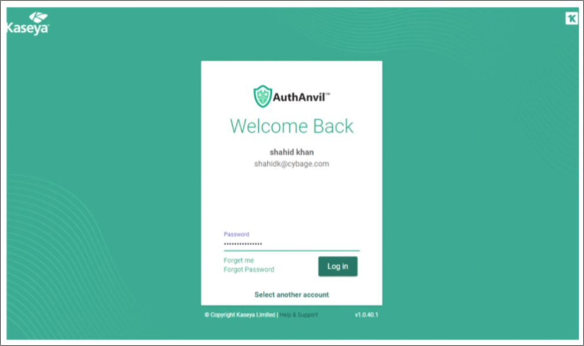
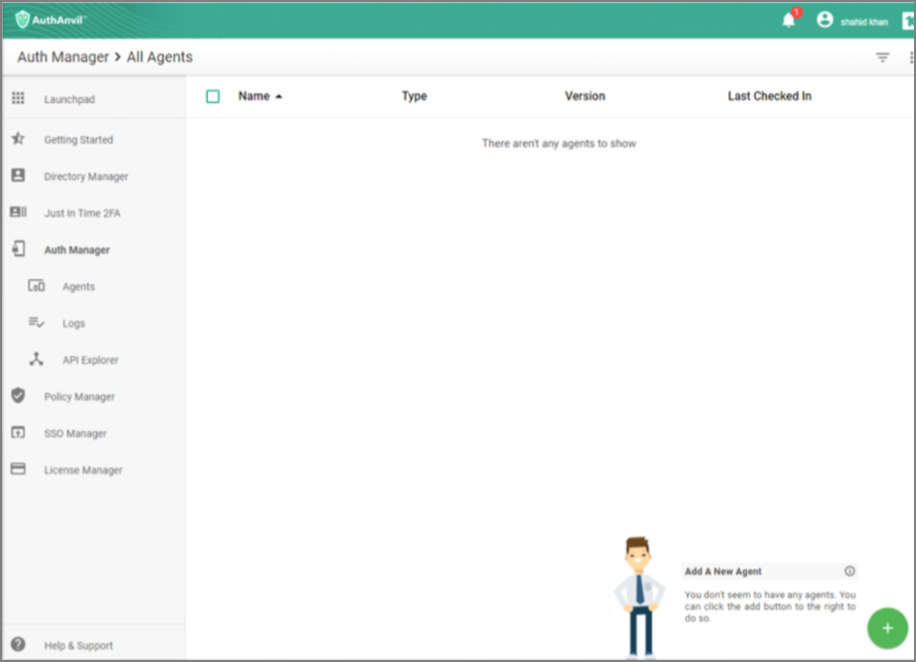
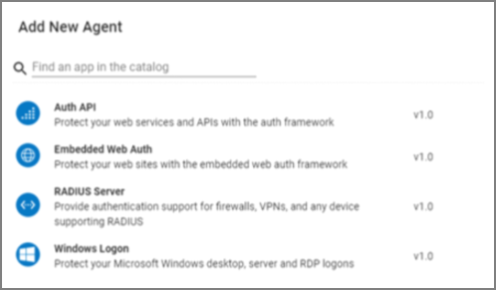
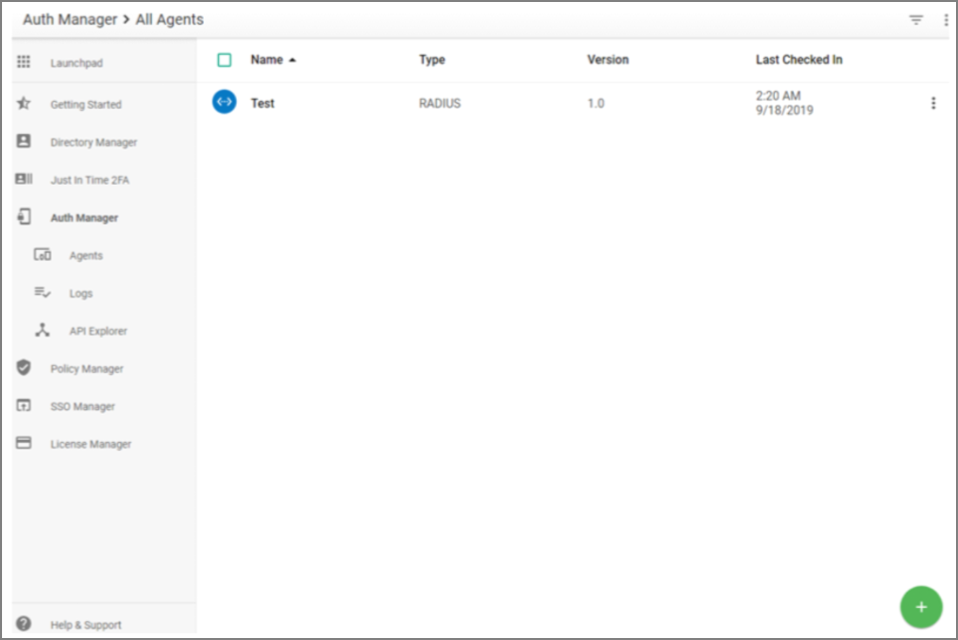
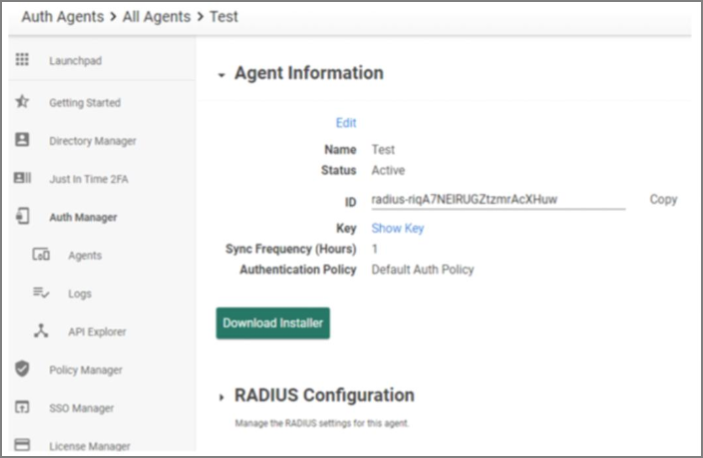
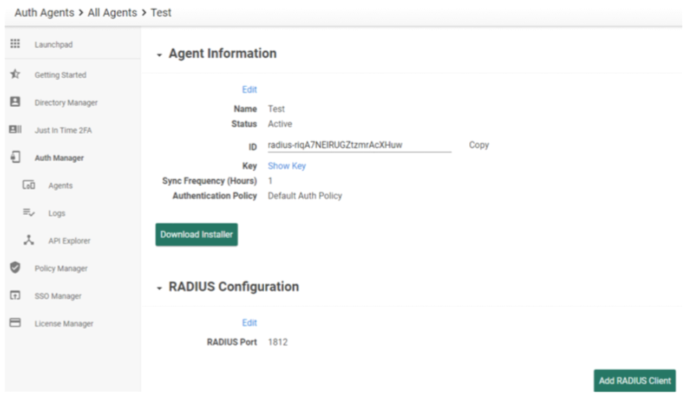
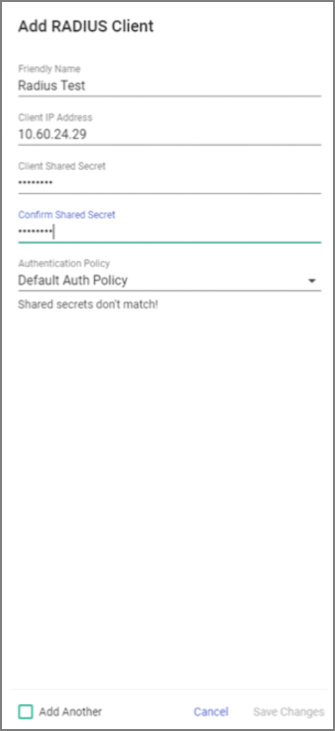

[title]: # (Add a RADIUS Agent)
[tags]: # (agent)
[priority]: # (101)
# Add a RADIUS Agent

## Before you start

* Ensure you have administrative access to your AuthAnvil on Demand tenant.
* Ensure access to a computer that will host the RADIUS Client.
* Ensure access to the desired VPN capable device and are familiar with the configuration.

1. Log into your instance of AuthAnvil on Demand.

   
1. Click __Auth Manager | plus sign__ to add a new Agent.

   
1. Select __RADIUS Server__.

   
1. Enter a __name for the Agent__ to identify its uniqueness from the other agents.
1. Click __Add Agent__ in the lower right corner.(The content in the fields is only demonstrative and not to be used for your work.)The All Agents screen will appear with the new Agent listed.

   
1. Click the __name__ to display the Agent Information, and note the following as you will be prompted for this when installing the RADIUS Agent service:
   * ID: The unique ID of the agent.
   * Key: The auto-generated secret value of the agent.

   
   
   >**Note:** The above information is to be used ONLY at the time of installing the service.

1. Click __RADIUS Configuration__ and click __Add RADIUS Client__ button or edit the port to use for communication (default port is 1812).

   
1. In the Add RADIUS Client screen, perform the following:
   * Add a __friendly name__ for the Client, add the __Client IP address__, and add a __Client Shared Secret__. (The Client Shared Secret key is the password or key setup on each client added in AuthAnvil portal. The same key must be entered in the RADIUS configuration tab in Secret Server under RADIUS Shared Secret).
   * Confirm Shared Secret (formerly Confirm Password) for the Client.

   >**Note:** This is the shared Secret that will be placed on the forwarding device/router to authenticate the communication.

    

    >**Note:** This is the shared secret that will be placed on the forwarding device/router to authenticate the communication.

1. Select __Save Changes__.

   >**Note:**  To add more than one client, select the __Add Another__ checkbox before selecting the Add RADIUS client button.