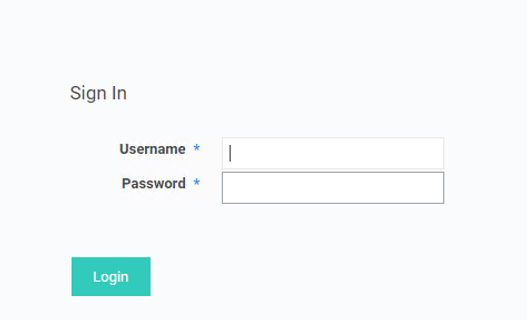
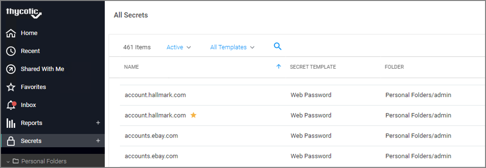
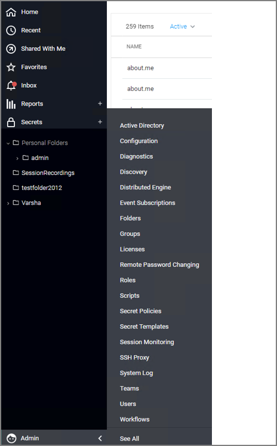
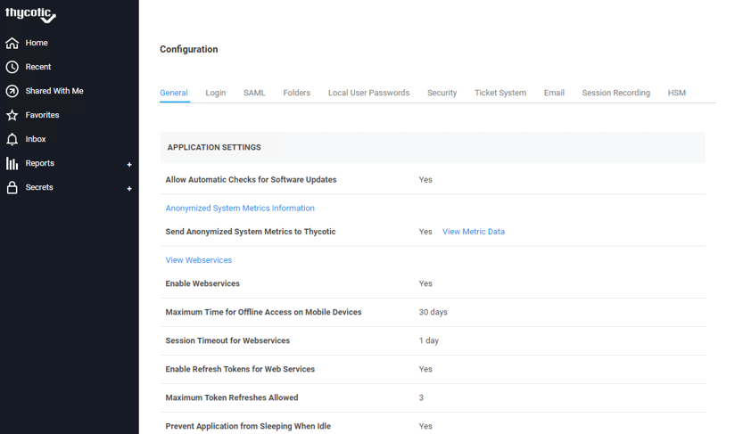
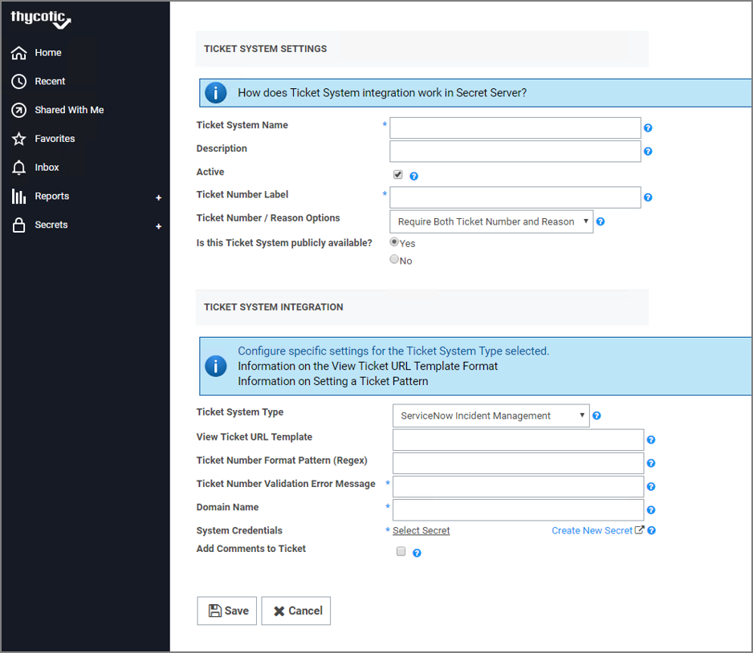
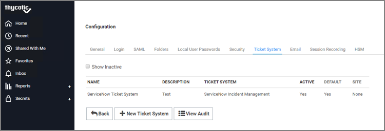
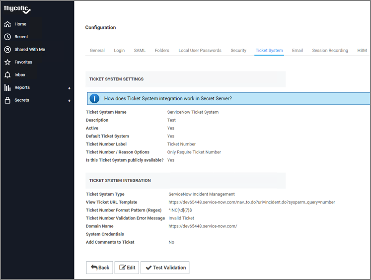

[title]: # (Validating Ticket Number in Secret Server)
[tags]: # (steps)
[priority]: # (203)
# Step Three: Validating Ticket Number in Secret Server

Validate the incident by accessing Secret Server.

__To validate incident in Secret Server:__

1. Sign into __Secret Server__.

   
1. The __All Secrets__ page appears.

   
1. Click __Admin | Configuration__.

   
1. The __Configuration__ page appears.

   
1. Click the __Ticket System__ tab.

   
1. Click __New Ticket System__. The __TICKET SYSTEM SETTINGS__ page appears.

   
1. In the __TICKET SYSTEM SETTINGS__ area, fill in the required information.

   a.__Ticket System Name__: Type the name for the ticket system.

   b.__Description__: Type the details about the ticket system.

   c.__Active__: Select the check box if the ticket system is active.

   d. __Ticket Number Label__: Type the label for the ticket number.

   e. __Ticket Number/Reason Options__: Select the appropriate value from the list.

   f. __Is this Ticket System publicly available__: Select __Yes__ option if the ticket system is publicly available.

1. In the __TICKET SYSTEM INTEGRATION__ area, fill in the required information.

   a. __Ticket System Type__: Select __ServiceNow Incident Management__ from the list.

   b. __View Ticket URL Template__: The ticket URL template is in the format: https://<instance name>.service-now.com/nav_to.do?uri=incident.do?sysparm_query=number=$TICKETID. For example:  https://dev65448.service-now.com/nav_to.do?uri=incident.do?sysparm_query=number=.

   c. __Ticket Number Format Pattern (Regex)__: There is a specific pattern based on the Regex for each ticket number. Before calling the ServiceNow web service, the Secret Server validates the number that matches the pattern. The samples expression to validate the ticket numbers are: Incident Management - ^INC[\d]{7}$ and Change Management - ^CHG[\d]{7}$.

   d. __Ticket Number Validation Error Message__: Type the error message that is to be displayed for a validation error.

   e. __Domain Name__: Type the name of your instance in a format - <instance name>.service-now.com. For example: https://dev65448.service-now.com/.

   f. __System Credentials__: Click to select a secret. This secret will be associated with the ticket number.

   g. __Add Comments to Ticket__: Select to add a comment to the ticket system.

1. Click __Save__. The Ticket System tab appears with details of the ticket created.

   
1. Click the latest ticket you created. The __Ticket System Settings__ page with the details appears.

   
1. Click __Test Validation__. The __Test Ticket System Validation__ dialog box appears.

   
1. In the __Sample Ticket Number__ text box, type the sample ticket number.

   >**Note:** Ticket number is the incident number which is created in ServiceNow instance.

1. Click __OK__. If the validation is successful, the following success message appears: __Ticket Number was validated successfully__.

ServiceNow is integrated successfully with Secret Server.
