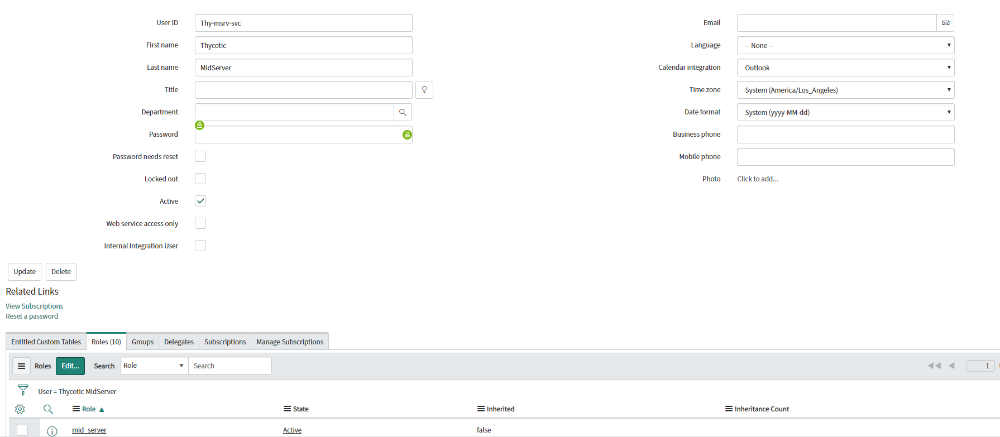
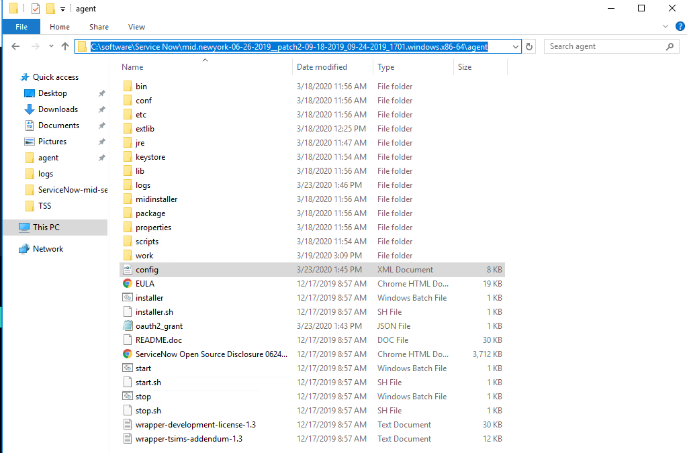
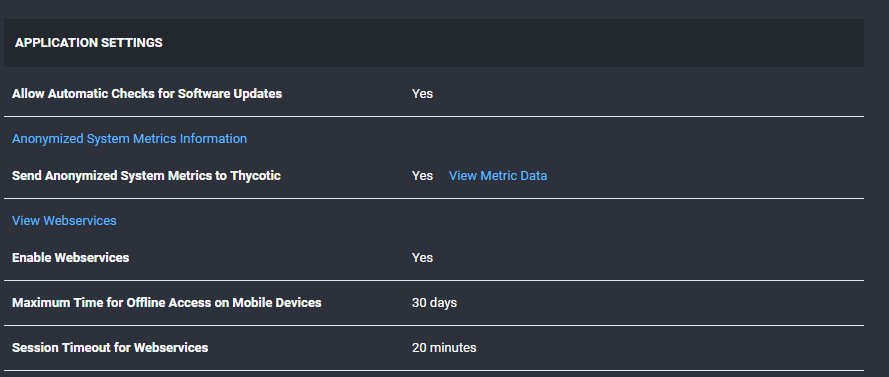
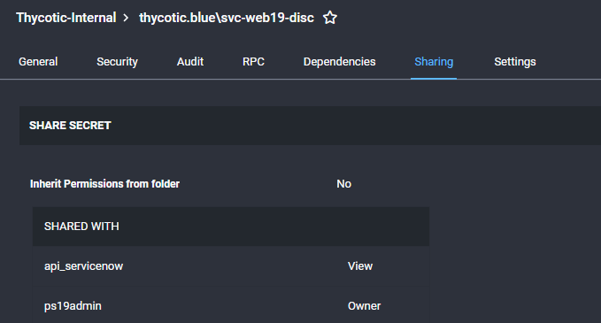
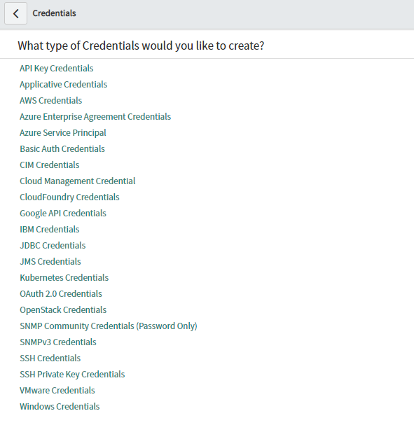

[title]: # (Configuration)
[tags]: # (introduction)
[priority]: # (100)
# Configuration

1. Install the Mid-Server on the system that has been designated to host the
    Mid-Server function. You can retrieve the Download link by navigating to the
    **MID Server** section in ServiceNow and clicking **Downloads**. For this
    tutorial we chose 64 bit.

   

1. Follow the instructions outlined in this article if you need any assistance
    with the installation of the Mid-Server -
    <https://docs.servicenow.com/bundle/london-servicenow-platform/page/product/mid-server/task/t_InstallAMIDServerOnWindows.html#t_InstallAMIDServerOnWindows>

   >**Note:** When installing the MID Server you will be providing the
ServiceNow MID Server username and password. This is the user that you created
during the pre-requisites section within ServiceNow. Below is a screenshot of
the user account we created for our documentation*

   

   Verify that the Mid-Server Status is **Up** and that is has been validated
before proceeding to the next steps. This can be found under the **Orchestration
\> MID Servers** category.

   

1. Upload the .jar file provided to ServiceNow by logging into your ServiceNow
    instance and navigating to **MID Server \> JAR Files.** Click the **New**
    button and provide all relevant information. Click on the attachment
    paperclip icon to upload the .jar file and once you’ve entered all relevant
    information click **Submit.** Below is an example of ours.

    

1. Add the following to the target MID Server(s) config.xml. These parameters
    will be added in near the bottom of the file:

   __To request an OAuth2 Access Grant from the server:__

   \<parameter name="ext.tss.url"
value="*https://your-secert-server.com/SecretServer*" /\>

   \<parameter name="ext.tss.oauth2.username"
value="your_ss_mid_server_app_account" /\>

   \<parameter name="ext.tss.oauth2.password"
value="your_ss_mid-server_app_account_pw" /\>

   \<parameter name="ext.tss.allow.self_signed_certificates" value="false" /\>

   

   >**Note:** It is important that you restart the MID server after making modifications to the config.xml

   

   __To use an OAuth2 Access Grant stored in a file:__

   \<parameter name="ext.tss.url"
value="https://your-secert-server.com/SecretServer" /\>

   \<parameter name="ext.tss.oauth2.grant_file" value="/path/to/oauth2_grant.json"
/\>

   \<parameter name="ext.tss.allow.self_signed_certificates" value="false" /\>

   >**Note:** that the OAuth2 user used to obtain the access_token must be a Secret Server User with "View" access on the secret(s) being used as Credentials in ServiceNow Discovery. Using *Application User* credentials is recommended.When using an access_token from an OAuth2 Grant in a file, a script like Get-OAuth2AccessToken.ps1 (example PS script provided below) should be run with enough frequency to ensure that the token in the file is never expired.

   ```

   # Secret Server is running with a self-signed certificate)
   #[System.Net.ServicePointManager]::ServerCertificateValidationCallback = {$False }
   [Net.ServicePointManager]::SecurityProtocol = [Net.SecurityProtocolType]::Tls12
   #netsh winhttp import proxy source=ie

   $secret_server_url = "https://srv-usp1-web19.thycotic.blue/SecretServer"
   $secret_server_api_url = \$secret_server_url + "/api/v1"
   $secret_server_oauth2_token_url = \$secret_server_url + "/oauth2/token"
   $oauth2_grant_request = \@{ 'username' = 'api_servicenow; 'password' =
   'your_app_account_pw'; 'grant_type' = 'password'; }
   Invoke-WebRequest -Method Post -Uri \$secret_server_oauth2_token_url -Body
   $oauth2_grant_request -OutFile "path\\to\\agentdir\\oauth2_grant.json"
   ```

   

   To keep the configuration simple, we stored the oauth2_grant in the same location as the agent config.xml file. It is recommended to configure this as a scheduled task that runs every 19 minutes. Secret Server defaults to have a session timeout for web services of 20 minutes.

   

   Below is an example of the required permissions per secret you intend to integrate with:

   

1. In the **Orchestration** section go to **Mid Server Configuration
    Credentials** and click on **New.** Choose the option for **Windows
    Credentials.**

   

   Fill out all relevant information. For the CredentialID field, be sure to enter the SecretID in the field and then place a checkmark in the **External Credential Store** option.

   

   >**Note:** The SecretID can be found in the URL of the Secret you would like to integrate with.

   

   `/SecretServer/app/\#/secret/2/sharing – **[2]** is the SecretID`

   Then, whenever adding a Credential in ServiceNow, check External credential store and enter the Id of the Thycotic Secret Server secret to which this credential corresponds, in the Credential ID field. These values should always match.
