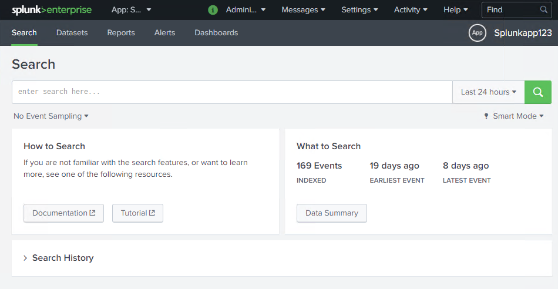

[title]: # (Create Dashboard)
[tags]: # (introduction)
[priority]: # (107)
# Create Dashboard

The second step is to fill in the Create a New Dashboard dialog box and add
source code to create a new dashboard.

**To create a dashboard:**

1.  Go to the **Apps** page.

2.  Click **Launch app** in the **Actions** column of the app you created.

>   The **Search** page appears.

1.  Click the **Dashboard** menu. The **Dashboards** page appears.

    

2.  Click **Create New Dashboard**. The **Create New Dashboard** dialog box
    appears.

    

3.  In the **Title** text box, type the title for the dashboard.

4.  In the **Permissions** field, select **Shared in App**.

5.  Click **Create Dashboard**. The **\<title of the dashboard\>** page appears.

    

6.  In the **Edit Dashboard** area, click **Source**.

1.  Copy the entire code from [Appendix One](#appendices) and paste in the code
    editor.

    

2.  On the upper-right, click **Save**. The dashboard appears.

    