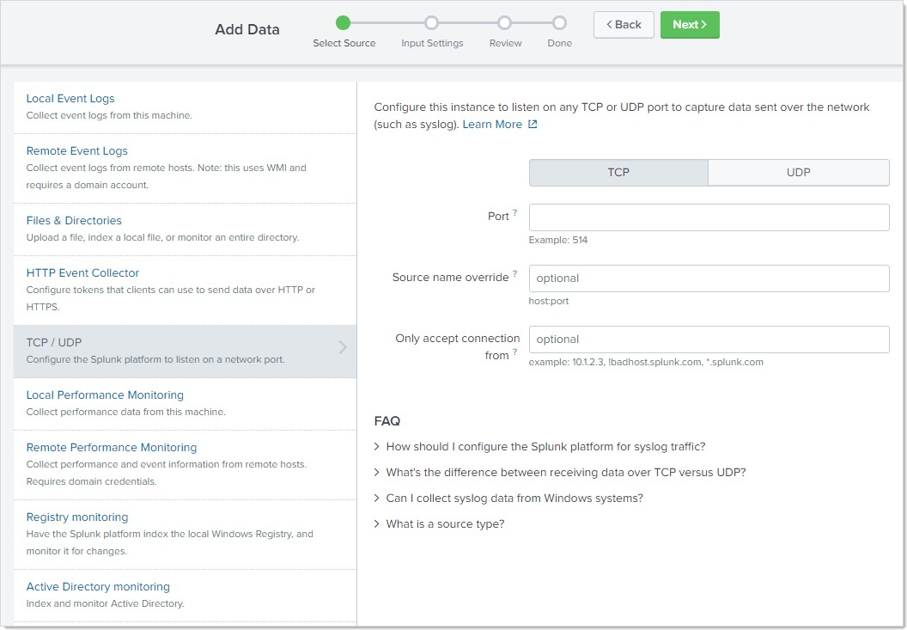

[title]: # (Configuring Splunk)
[tags]: # (configuration)
[priority]: # (102)
# Configuring Splunk

1. Go to Splunk at https://login.splunk.com.

1. Click the user icon at the top right and select __Sign Up__.

1. Complete the __Create Your Splunk Account__ page.

1. Click the __Create Your Account__ button.

1. Download the [Splunk Enterprise
    setup](https://www.splunk.com/en_us/download/splunk-enterprise.html).

1. Install Splunk Enterprise.

1. Log into your Splunk Enterprise at
    [http://localhost:8000/](http://localhost:8000/en-US/account/login).

   >**Note:** The first time you log in, use the default username "admin" and the password you set during installation. You can then change the password and log in again with your new password.

1. On the Splunk console home page, click the __Add Data__ button. The Add Data
    page appears:

   
1. Click the __Monitor__ button at the bottom of the page. The unlabeled Select
    Source page appears:

   
1. Click the __TCP/UDP__ menu item on the left. Data entry controls appear:

   
1. Click the __TCP__ button.

1. Type `200` in the __Port__ text box. This port must match the port
    configured in SS for the syslog.

1. Type the IP address of your SS machine in the __Only accept connection
    from__ text box.

1. Click the __Next__ button. The Input Settings page appears:

   
1. Click the __Select Source Type__ dropdown list and select __Operating System | syslog__.

1. Click the __Review__ button. A review listing appears:

   
1. Confirm the settings.

1. Click the __Submit__ button.
