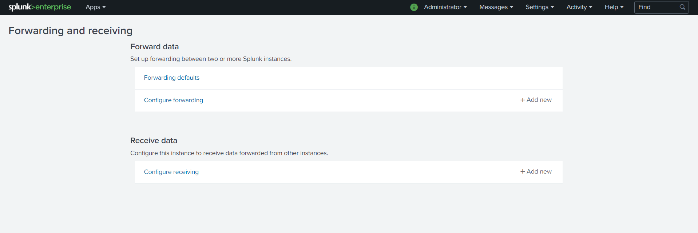
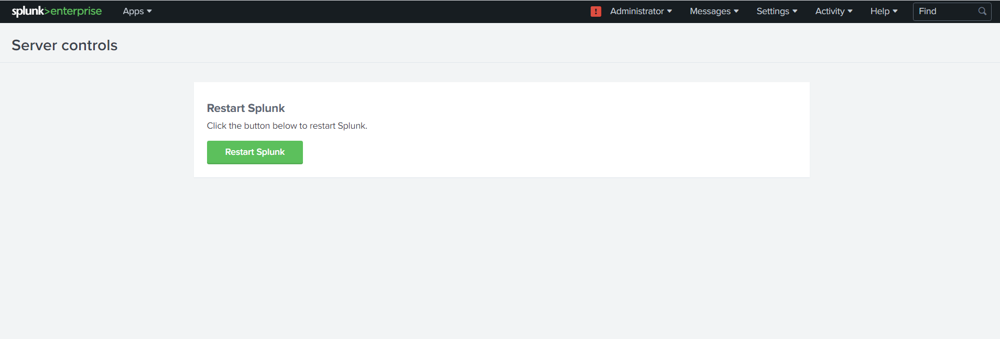
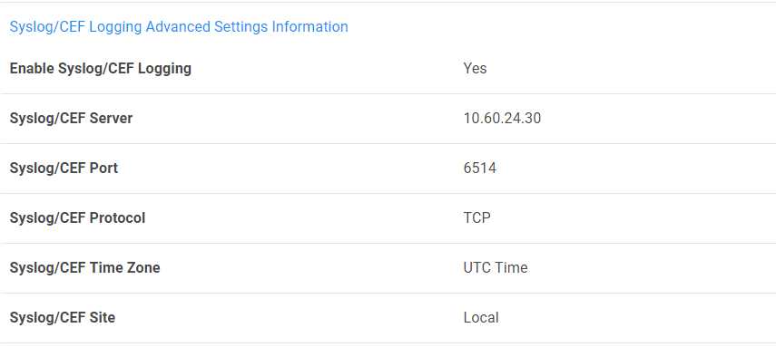
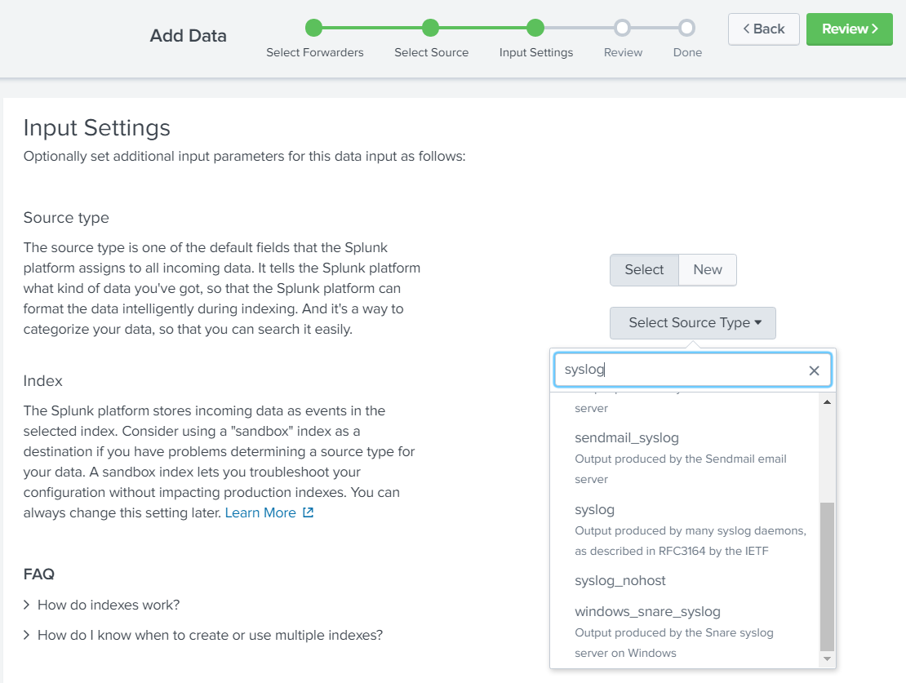
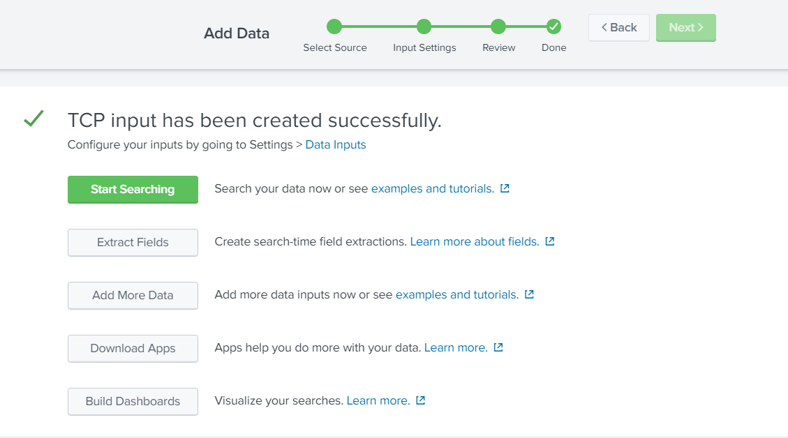
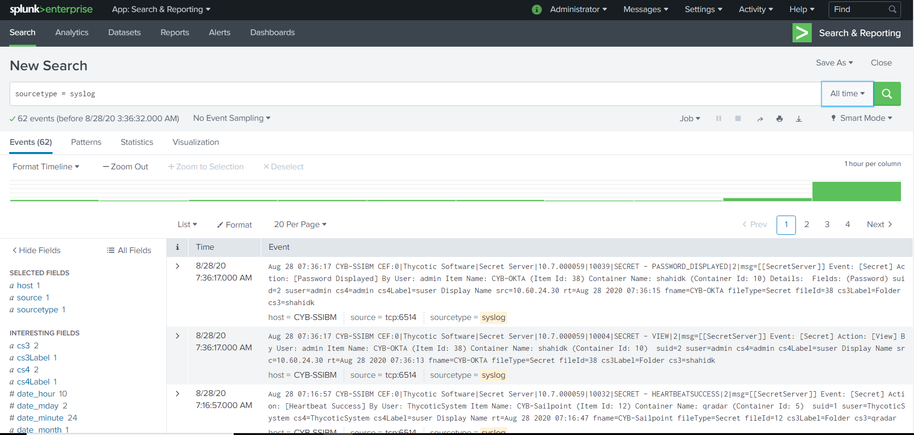

[title]: # (Setting up the Windows heavy forwarder)
[tags]: # (heavy forwarder)
[priority]: # (103)
# Setting up the Windows heavy forwarder to forward data to the splunk cloud

Setting up a [heavy](https://docs.splunk.com/Splexicon:Heavyforwarder) forwarder is a two-step process:

## Install a full Splunk Enterprise instance

1. After completing the installation, log in to your Splunk as an admin on the instance that will be forwarding data.

1. Click __Settings__ | __Forwarding and receiving__.  

   
1. Select __Forwarding defaults__.  

   
1. Select __yes__ to store and maintain a local copy of the indexed data on the forwarder.  

   
1. At Configure forwarding, click __Add new__.  

   
1. Enter the hostname or IP address for the receiving Splunk instance(s), along with the __receiving port__ specified when the receiver was configured. For example, you might enter __receivingserver.com:9997__.

   
1. Click __Save__.
1. Navigate to __Server Control__ by clicking on __Setting__ | __Server Control__.

   
1. Click on __Restart Splunk__.

   
1. Download the SPL package from your splunk cloud.

   >**Note:** It is not the regular universal forwarder exe you get from splunk (no need to install the separate universal forwarder software).<https://yourcloudname.splunkcloud.com/en-US/app/splunkclouduf/setupuf>

1. On the Splunk Cloud Home page, click __Download Universal Forwarder Credentials__ to download the splunkclouduf.spl file.

   
1. When prompted, click __Save File__ and click __OK__. By default,
the splunkclouduf.spl file downloads to the Downloads directory. If you download to a different location, make note of that location.

1. Move the splunkclouduf.spl file to the `C:\\ProgramFiles\\Splunk\\etc\\apps directory of your enterprise.`
1. Open a command prompt window and run the following command:
`tar xvf splunkclouduf.spl`.

1. Navigate to the `/bin subdirectory` of your deployment server.

1. In the command prompt window, Run the following command on your Splunk Heavy Forwarder (or whatever path you install splunk too) :

   ```
    __splunk install app \<full path to splunkclouduf.spl| -auth
    \<username|:\<password|__ where \<full path to splunkclouduf.spl| is the path to the directory where the splunkclouduf.spl file is located and \<username|:\<password| are the username and password of splunk enterprise.

   ```

1. Restart your forwarder: `/splunk restart`.
1. Once splunk is restarted you'll need to check the correct __output.conf__ is installed.
1. Make sure that `C:\\ProgramFiles\\Splunk\\etc\\apps\\yourcloudnamesplunkcloud\\default\\outsputs.conf`is the same as `C:\\Program Files\\Splunk\\etc\\system\\local\\outputs.conf`.

1. __If__ the files above aren't the same copy `C:\\ProgramFiles\\Splunk\\etc\\apps\\yourcloudnamesplunkcloud\\default\\outsputs.conf to C:\\Program Files\\Splunk\\etc\\system\\local\\outputs.conf and restart splunk.`

## Configuring Secret Server settings

__To configure Secret Server settings:__

1. Sign into __Secret Server__.

   
1. The __Home__ page appears.

   
1. Click __Admin__ | __Configuration__. The __Configuration__ page appears.

   
1. At the bottom of the page, click __Edit__.  

   
1. The __Edit Configuration__ page appears.  

   
1. Select the __Enable Webservices__ settings check box.

1. Under the __Syslog/CEF Logging Advanced Settings Information__ area, select the __Enable Syslog/CEF Logging__ check box and enter the __syslog server__

   >**Note:** This should be the ip of machine/server where splunk enterprise is configured).

   

1. At the end of the page, click __Save__.  

   

## Configuration in Splunk enterprise

1. Go to __Splunk enterprise__ | __Settings__ | __Add Data__ | Click on __Monitor__.

1. The __Select Source__ page appears. On the left-hand side, click __TCP/UDP.__

1. On right hand side, select UDP/TCP and enter the port which we have configured in Secret Server, Example: __TCP 6514__.  

   
1. Click __Next__. On __Input Settings__ page select source type as syslog.  

   
1. In the __Index__ list, select __Default__.
1. Click __Review__. The __Review__ page appears, review the information.
1. Click __Submit__. The message “__File input has been created successfully.__” Appears

   
1. Click __Start Searching__. The __New Search__ page appears.
1. In the __New Search__ text box, type the query and click __Search icon__.

   

## Accessing Secret Server Events in the SplunkCloud

Login to splunk cloud and click on __search and Reporting and__ enter the query: `source=”syslog”` and click __Search icon__.

   
