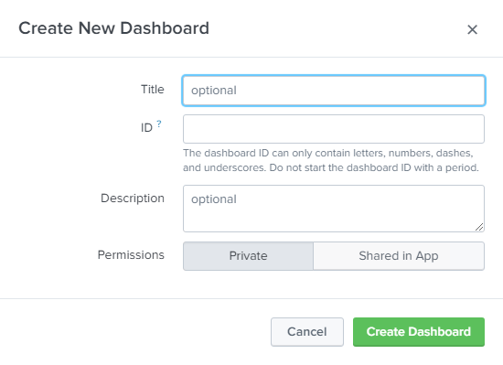
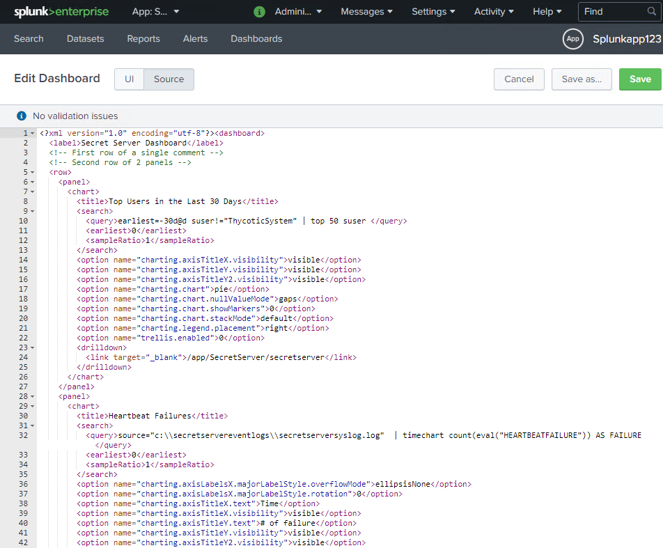
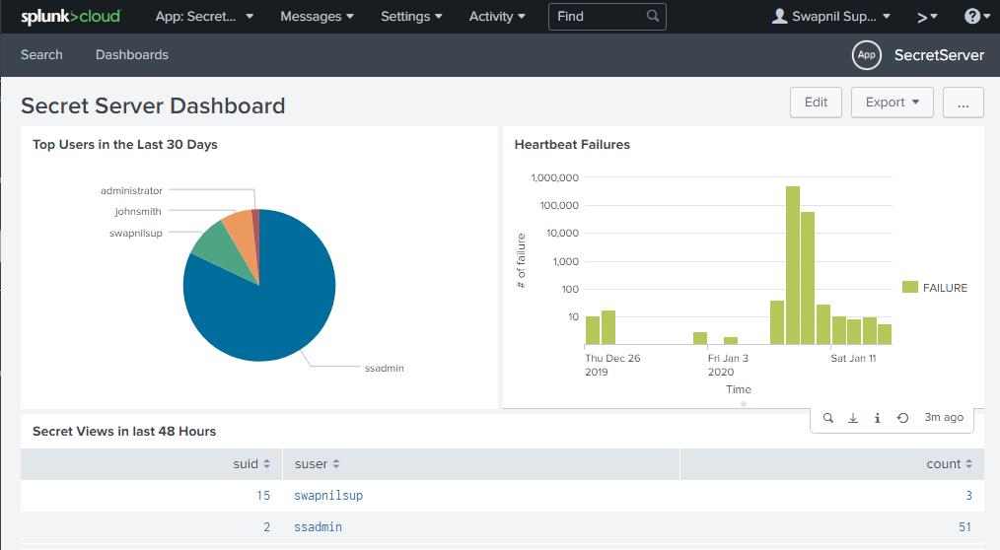

[title]: # (Create Dashboard)
[tags]: # (introduction)
[priority]: # (105)
# Create Dashboard

The second step is to fill in the Create a New Dashboard dialog box and add
source code to create a new dashboard.

## To create a dashboard

1. Go to the __Apps__ page.

1. Click __Launch app__ in the __Actions__ column of the app you created.

   
1. The __Search__ page appears.

   
1. Click the __Dashboard__ menu. The __Dashboards__ page appears.

   
1. Click __Create New Dashboard__. The __Create New Dashboard__ dialog box
    appears.

   
1. In the __Title__ text box, type the title for the dashboard.

1. In the __Permissions__ field, select __Shared in App__.

1. Click __Create Dashboard__. The __<title of the dashboard>__ page appears.

   
1. In the __Edit Dashboard__ area, click __Source__.

   
1. Copy the entire code from [Appendix One](#appendices) and paste in the code
    editor.

   
1. On the upper-right, click __Save__. The dashboard appears.

   
