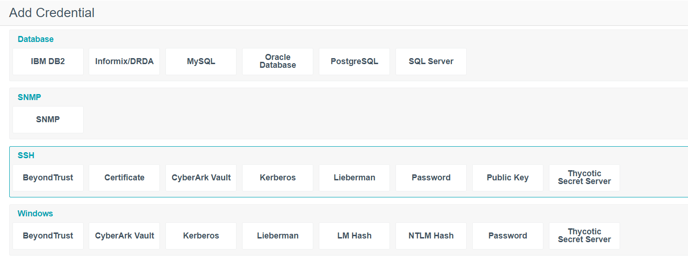
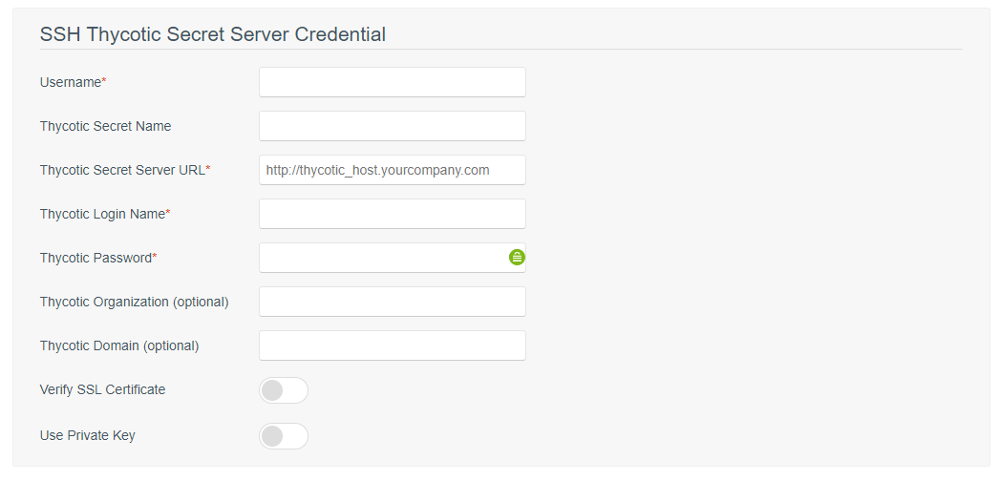
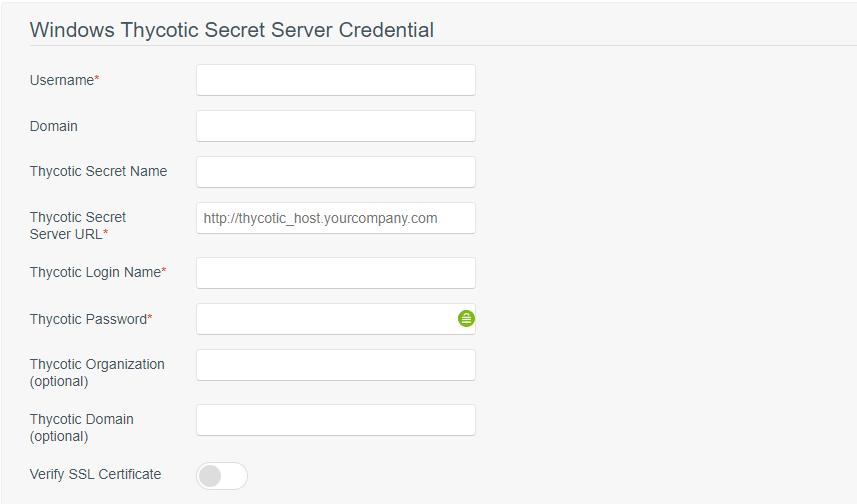
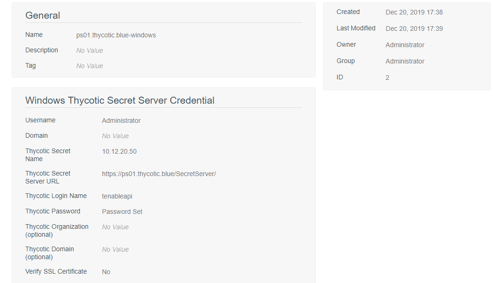
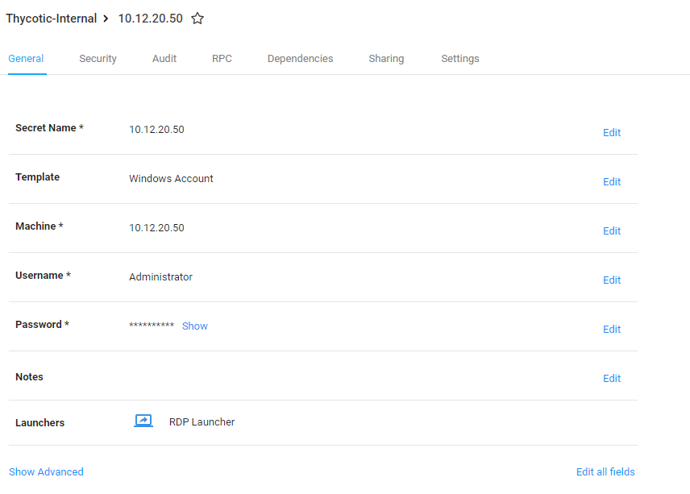
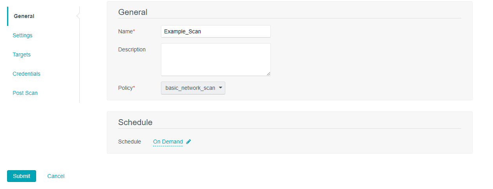
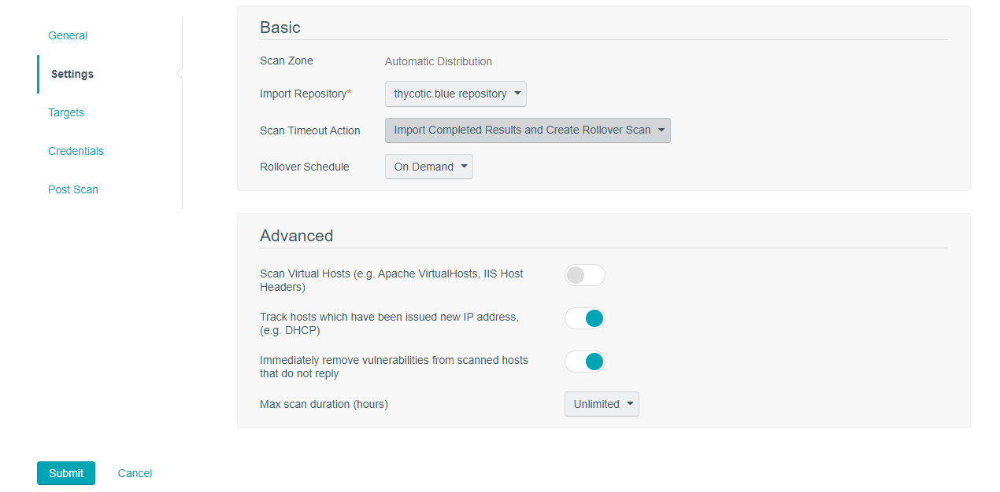
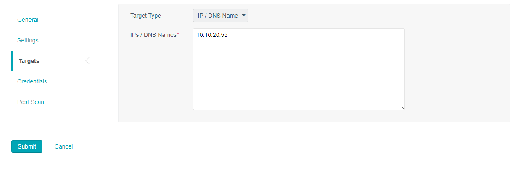
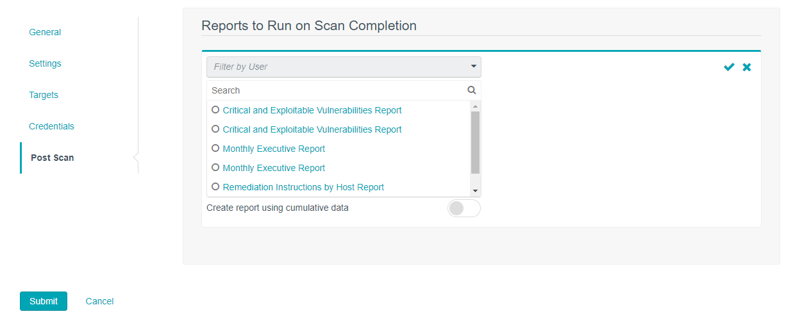

[title]: # (Tenable.sc Configuration)
[tags]: # (Tenable.sc)
[priority]: # (2)
# Tenable.sc Configuration

1. Log in to Tenable.sc.
1. In the top navigation bar, click __Scanning | Credentials__ (Administrator users) or __Scans | Credentials__  (organizational users). The Credentials page appears.

   

1. Choose the option for __Thycotic Secret Server__ for either SSH or Windows credentials based on what type of systems you intend to integrate with.

   

   >**Note:** Please be mindful that the Windows and SSH Secret Server Credential screens are very similar and there is only one major difference between them. The SSH Secret Server Credential screen offers the ability to “Use Private Key”. If this option is enabled, Tenable.sc uses key-based authentication for SSH connections instead of password authentication.

   
   

1. Fill out all required fields indicated in the screenshots above. A description of the fields can be found below. Once all fields required have been entered, click __Submit__.

| Option |  | Description |
|---|---|---|
|  Username |   | (Required) The username for a user on the target system.  |
| Domain  |   |  (Optional) The domain of the username, if set on the Thycotic server. |
| Thycotic Secret Name   |   |  (Required) The Secret Name value on the Thycotic server. |
|  Thycotic Secret Server URL |   |  (Required) The value you want Tenable.sc to use when setting the transfer method, target, and target directory for the scanner. Find the value on the Thycotic Server in __Admin  > Diagnostics__. In the Secret Server Environment Section, see the field “Secret Server Url”. For example, if you type https://pw.mydomain.com/SecretServer, Tenable.sc determines it is an SSL connection, that pw.mydomain.com is the target address, and that /SecretServer is the root directory.  |
| Thycotic Login Name  |   |  (Required) The username used to authenticate to the Thycotic server. |
|  Thycotic Password |   |  (Required) The password associated with the Thycotic Login Name you provided. |
|  Thycotic Organization |   | (Optional) in cloud instances of Thycotic, the value that identifies which organization the Tenable.sc query should target.  |
|  Thycotic Domain  |   | (Optional) The domain, if set for the Thycotic server.  |
|  Verify SSL Certificate   |   | If enabled, Tenable.sc verifies the SSL Certificate on the Thycotic server.  |
|  Use Private Key |   | (For SSH Credentials Only) – If enabled, Tenable.sc uses key-based authentication for SSH connections instead of password authentication.   |

   >**Note:** When completing this step, ensure that the “Thycotic Secret Name” field matches the Secret Name in Secret Server exactly. See below for a completed Windows example. Please note that this API account is a local (non domain) account.

   
   

1. During this step, ensure that the API account that will be connecting to Secret Server to retrieve the credentials has “View” permission to the secrets intended on being integrated.

   .png

1. After the credentials are saved, you will need to create an applicable policy with your Administrator account in Tenable.sc. Log on to Tenable.sc and create a policy based on the type of scan you would like to run (not pictured). Once the policy is created, you will need to create an Active Scan. An Active Scan can only be configured as a non-Administrative user.

1. Log out of Tenable.sc and log back on as a user with the Security Manager role. On the Active Scan screen, click __Add__.

   

1. On the general tab, complete the required fields and associate the Policy you created in step 5. Change the schedule to your preference.

   

1. On the settings tab, choose the repository you created during the Requirements section of this document. Other options can be set based on preference.

   

1. On the targets tab, you can choose a Target Type based on Assets/ IP/DNS name or Mixed.

   

1. On the credentials tab, click the __Add Credential__ button, choose Windows or SSH respectively, and then the appropriate credential. The example below is based on an existing Windows credential for the host observed in step 9.

   

1. On the Post Scan tab, you can choose to run a report after the scan completes. We did not choose any option here. Click __Submit__ when ready.

   

1. On the Active Scans subpage, click the Run button located on the far right of the screen. This will kick off the actual scan against the Targets provided on the Targets tab and will utilize credentials provided on the Credentials tab that are retrieved from Secret Server. If scanning multiple Targets, ensure all appropriate credentials are added to the Credentials tab.

   