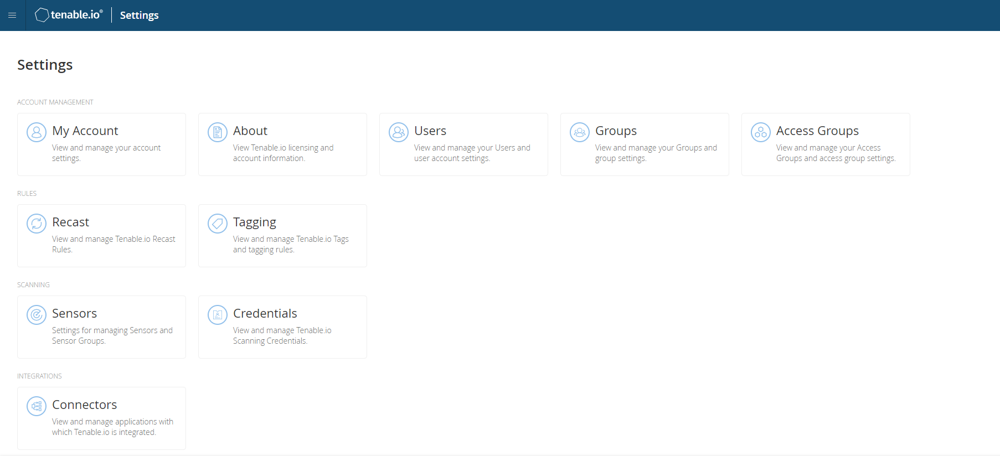
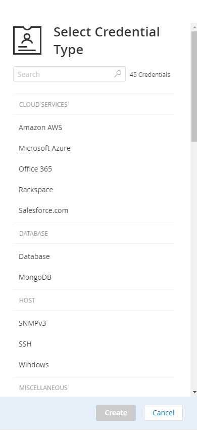
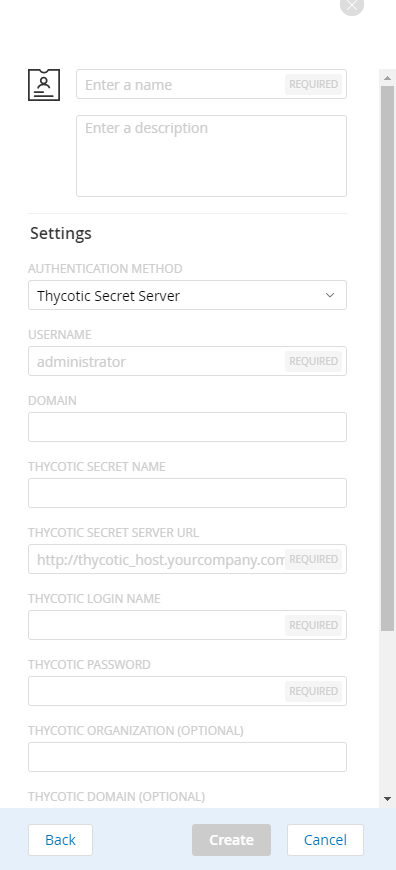
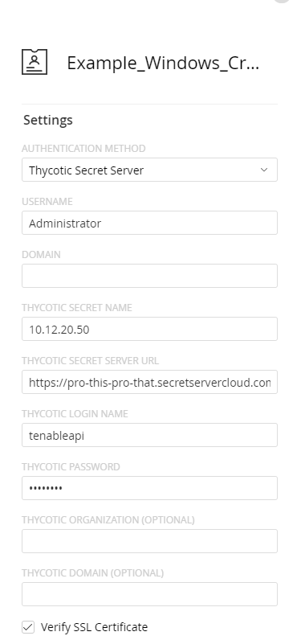
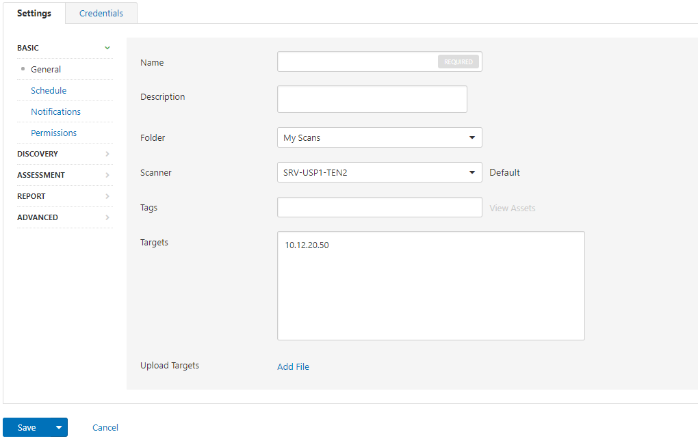
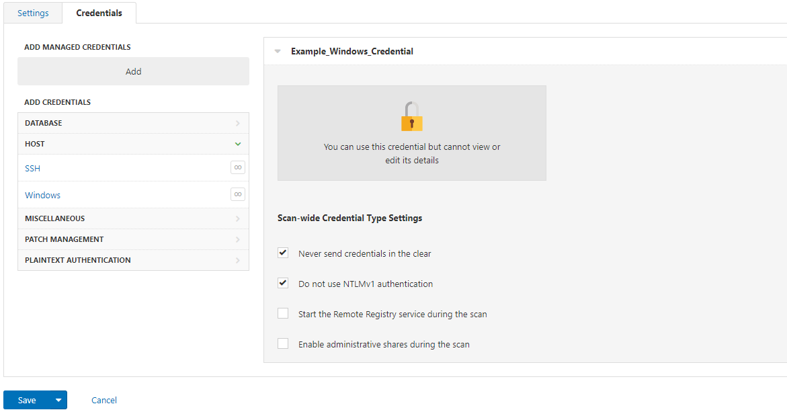
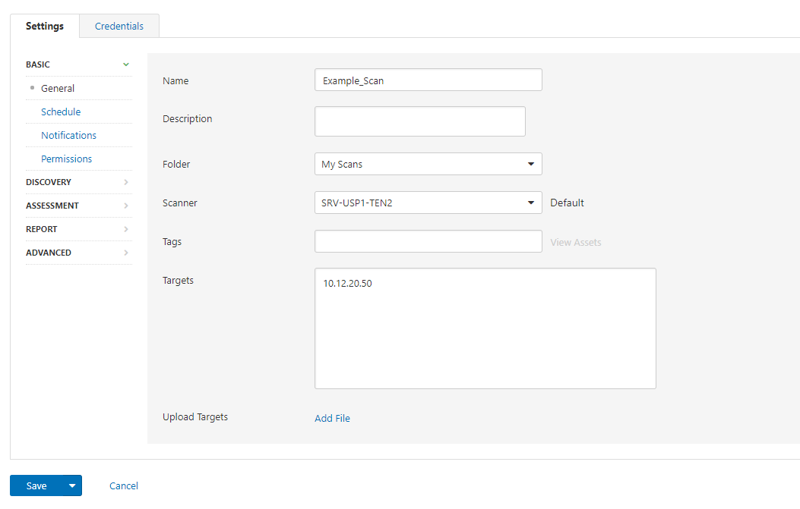

[title]: # (Tenable.io Configuration)
[tags]: # (Tenable.sc)
[priority]: # (3)
# Tenable.io Configuration

   >**Note:** These instructions below are provided for configuration purposes only. We have not observed this integration to work correctly. For more details, check the [Constraints and Limitations](../../tenable\getting-started\constraints.md) section.

   >**Note:** Please make sure you already have a Nessus scanner connected to your Tenable.io instance. These instructions utilize the new UI

1. In Tenable.io, click on the Main menu located in the upper left corner of the screen and click on __Settings__.

   
1. Click on the __Credentials__ option. On the Credentials page, Click on the __+__ icon to add a new Credential.

   
1. On the Pop up screen on the right side of your screen, choose the option for __Windows__ or __SSH__ respectively on the Select Credential Type screen.

   
1. Under the __Authentication Method__ drop down menu, choose the option for __Thycotic Secret Server__.

   
1. Fill out all required information and then click __Create__ to create the credential. In the example below, we choose a Windows credential. After you click create, you will observe the credential you created on the Credentials page.

   

   
1. The next steps may only be completed under the Classic Tenable.io user interface. Switch to the classic user interface and choose the option for __Scans__ on the top menu bar. Then. Choose the option for __New Scan__.

   
1. In my example below I have chosen the option to do a __Basic Network Scan__. I choose the appropriate scanner and then add in relevant targets.

   
1. On the __Credentials__ tab, click the option for Managed Credential and add in the appropriate credential based on the targets selected. To add in multiple credentials, choose the option to Add Managed Credentials again. In the example below, the credential was created with an Administrator account and then shared with another account and given “Can Use” permissions.

   
1. Once you have completed all additional tabs that may be relevant for your scan, click the __Save__ button.

   
1. Test the integration under the __My Scans__ tab by clicking the arrow on the far right of the screen to run the scan.

   
