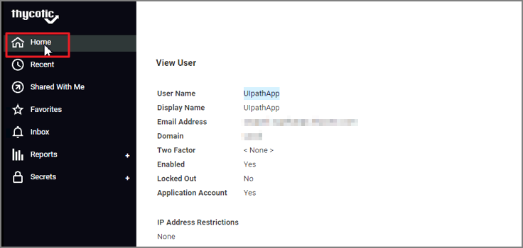
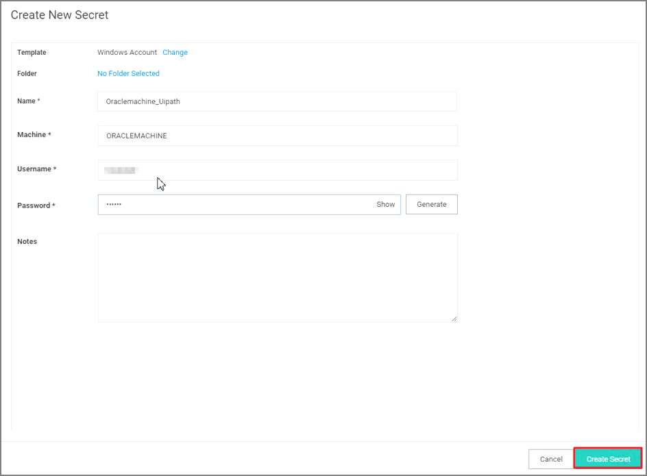
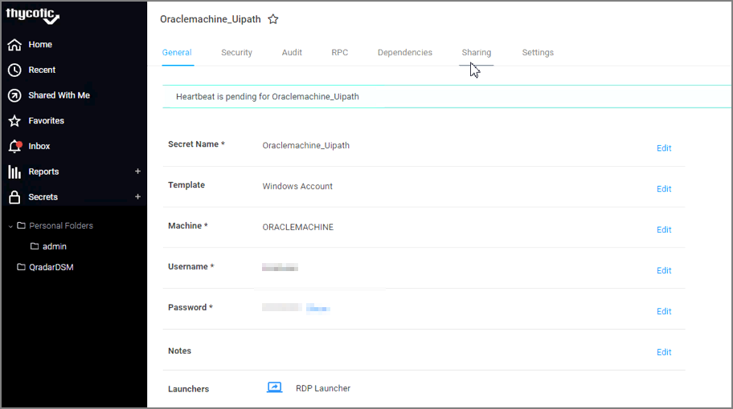
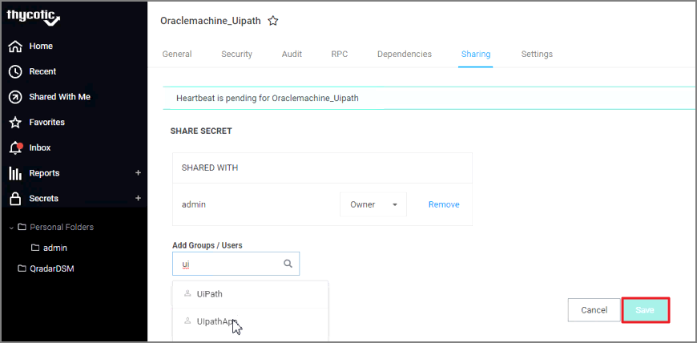

[title]: # (Configuration)
[tags]: # (configuration, uipath)
[priority]: # (203)
# Configuration Steps for Secret Server

## Create an Application Account

1. Navigate to Secret Server and login with the Administrator account.

   
1. Click __Admin | Users__.

   
1. Click the __Create New__ button at the bottom of the screen.

   
1. Enter in a __User Name, Email Address and Password__.

   
1. Click the __Advanced__ option.
1. Check the box for __Application Account__.
1. Click __Save__.

   
1. Click __Ok__ on the next screen to convert the user to an Application Account.

   
1. Click on __Assign Roles__.
   
1. Assign the following Roles in the screenshot below __(Administrator, Basic User, Group Owner, Read Only User, User, User Owner)__.
1. Click __Save Changes__.

   

## Create a Secret for the UiPath

1. Navigate back to __Home__ in Secret Server.

   
1. Click on (+) next to __Secrets__.

   
1. Search for the __Windows Account__ template.
1. Click on __Windows Account__.

   
1. For the New Windows Account template, you will need to complete the following fields:
   * __Name__: Name of the Secret
   * __Machine__: The server that UiPath is installed onto
   * __Username and Password__: The account that has access to the UiPath Server
1. Click __Create Secret__.

     
1. Click on the __Sharing__ Tab.

     
1. Click on __Edit__.

     
1. Under the Search area for __Add Groups/Users__, enter in your __UiPath application account__.
1. Click __Save__.

     
