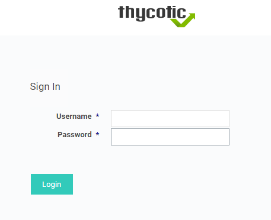
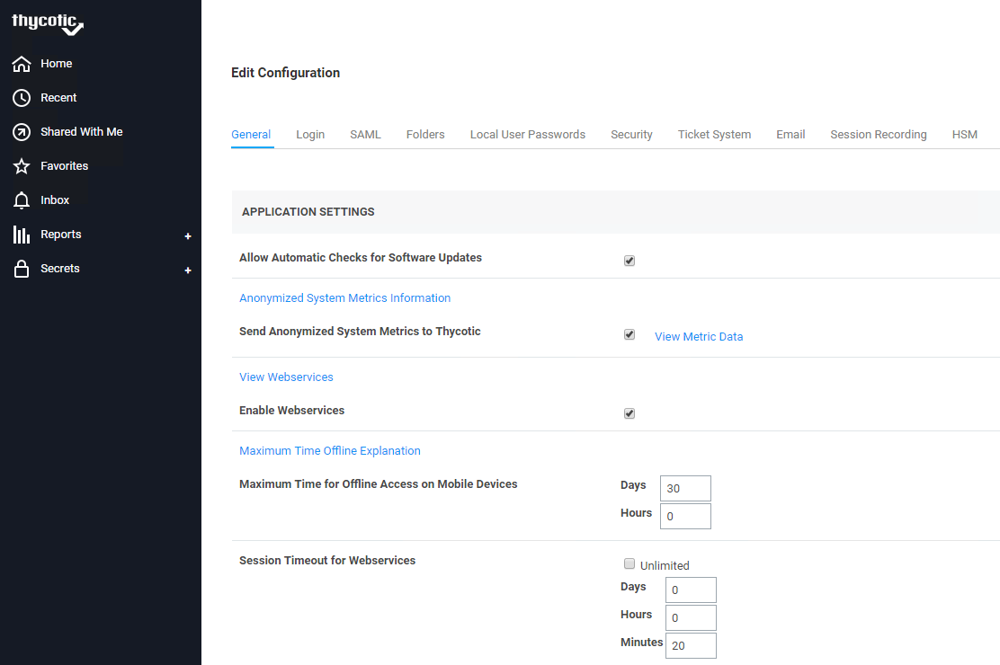
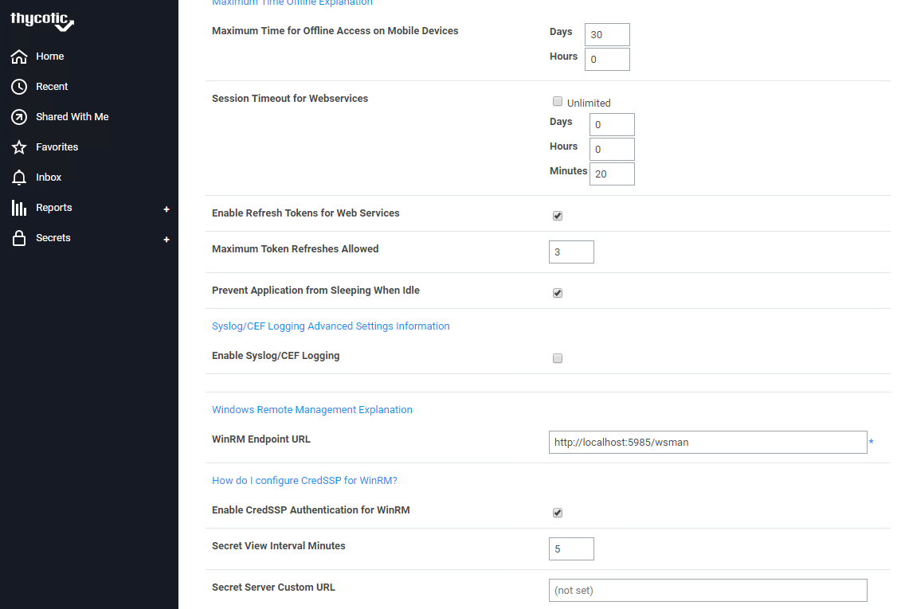

[title]: # (Configure Secret Server)
[tags]: # (witfoo,secret server)
[priority]: # (1)
[display]: # (all)
# Configure Secret Server for WitFoo

You must configure settings in Thycotic Secret Server for WitFoo to fetch SysLog details.

To configure Secret Server settings:

1. Sign into __Secret Server__.

  

  The __All Secrets__ page appears.

  
1. Click __Admin__ | __Configuration__.

   

   The __Configuration__ page appears.

   
1. At the bottom of the page, click __Edit__.

   

   The __Edit Configuration__ page appears.

   
1. Under __Syslog/CEF Logging Advanced Settings Information__ area, select __Enable Syslog/CEF Logging__ check box.

   
1. Configure the following settings:

    
    * In the __Syslog/CEF Server__ box, type the __IP address__ of the WitFoo virtual appliance.
    * In the __Syslog/CEF Port__ box, type the __port number__ of the WitFoo virtual appliance.
    * In the __Syslog/CEF Protocol__ list, select the __protocol__.
1. Click __Save__.

   You will start receiving event logs. For example, in Secret Server, if you have created a user and assigned a role to the user, those logs are populated in the WitFoo virtual appliance.
