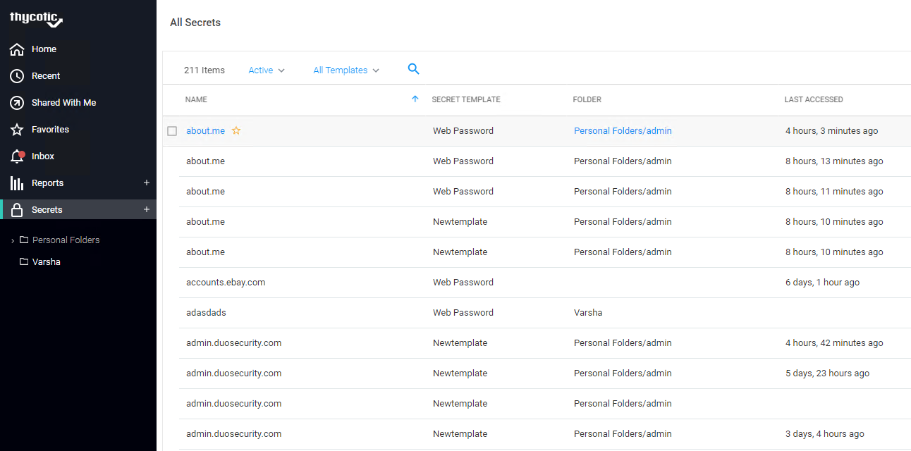

[title]: # (Secret Server)
[tags]: # (witfoo,secret server)
[priority]: # (2)
[display]: # (all)

# What to do in Secret Server

<!-- add configuration information detailing steps to do on Secret Server-->

You must configure settings in Thycotic Secret Server for Witfoo to fetch
syslogs.

To configure Secret Server settings:

1.  Sign into **Secret Server**.

The **All Secrets** page appears.

1.  Click **Admin** \> **Configuration**.

    

    The **Configuration** page appears.

    

1.  At the bottom of the page, click **Edit**.

    

    The **Edit Configuration** page appears.

    

1.  Under **Syslog/CEF Logging Advanced Settings Information** area, select
    **Enable Syslog/CEF Logging** check box.

    

1.  Configure the following settings:

    

-   In the **Syslog/CEF Server** box**,** type the **IP address** of the Witfoo
    virtual appliance.

-   In the **Syslog/CEF Port** box, type the **port number** of the Witfoo
    virtual appliance.

-   In the **Syslog/CEF Protocol** list, select the **protocol**.

1.  Click **Save**.

# Install and Configure Ubuntu 18.04 LTS

You must install Ubuntu, configure network, install-prep, and run register to
complete the integration of Witfoo virtual appliance with Secret Server.

1.  Download Ubuntu 18.04 LTS from <http://releases.ubuntu.com/18.04/>

1.  Install Ubuntu 18.04 LTS.

1.  To create a user as Witfoo Admin, at the command prompt, type the following:

>   sudo adduser witfooadmin ; sudo usermod -aG sudo witfooadmin

>   and press **Enter**.

1.  Log in as a witfooadmin.

1.  Type the following to install prerequisites:

>   curl -k -o
>   /tmp/witfoo-precinct.deb** **<https://www.witfoo.com/data/witfoo-precinct.deb>** ;
>   apt install -y -f /tmp/witfoo-precinct.deb**

and press **Enter**.

1.  Type the following to register:

sudo /home/witfooadmin/register

and press **Enter.**

1.  Enter the **license key** provided by Witfoo.

1.  For selecting the role for the virtual appliance type **1** and press
    **Enter**.

**Notes:** By selecting 1 you assign all the roles.

1.  Change the password.

>   Witfoo virtual appliance is configured. This process may take some time.

1.  Type the URL in the browser: https://\<IP address of the Ubuntu
    image\>/register

    The login page of Witfoo virtual appliance appears.

1.  Complete the registration.

1.  Log in to the Witfoo virtual appliance with the registered credentials.

1.  In the search bar enter the **IP address** of Secret Server.

    You will start receiving event logs. For example, in Secret Server, if you
    have created a user and assigned a role to the user, those logs are
    populated in the Witfoo virtual appliance.